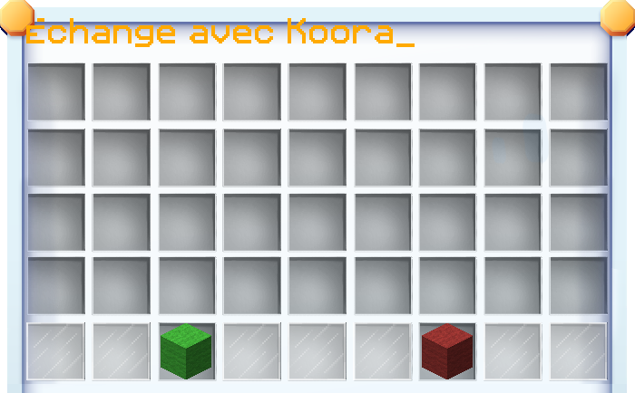

# 🔱 Échange sécurisé

Vous avez peur de vous faire arnaquer en effectuant un échange sur le serveur ? La solution est simple, l'échange sécurisé !


L'accès aux échanges sécurisés n'est possible que sur le serveur Factions.


### Comment l'utiliser ?

Pour réaliser un échange sécurisé, utilisez simplement la commande `/trade <joueur>`. Une interface s'ouvrir alors, celle-ci ressemblera à ceci :

<figure><figcaption>
Interface d'échange sécurisé
</figcaption></figure>


Vous devez être à moins de 16 blocs de la personne à qui vous souhaitez faire un échange.


Il vous suffira alors de déposer dans l'interface les objets que vous souhaitez échanger avec votre client. Une fois que vous êtes prêt, vous avez juste à cliquer sur le bouton `Prêt`.

Une fois que votre client a confirmé, vous pouvez voir sa proposition. Si vous êtes d'accord avec l'offre proposée, cliquez sur le bouton `Accepter`.


Il faudra que votre client clique aussi sur le bouton `Accepter` pour confirmer la transaction.


🎉 Et voilà, vous venez d'effectuer un échange sécurisé.

### Mais s'il s'agit de points boutiques ?

Il vous suffit de créer un post dans [cette section](https://forum.plutonia-mc.fr/forums/27/) du forum. En cas d'arnaque, vous serez remboursé, et le responsable sera sanctionné conformément à notre règlement.


Nous vous prions de bien respecter le modèle demandé avant de créer votre post de commerce.

