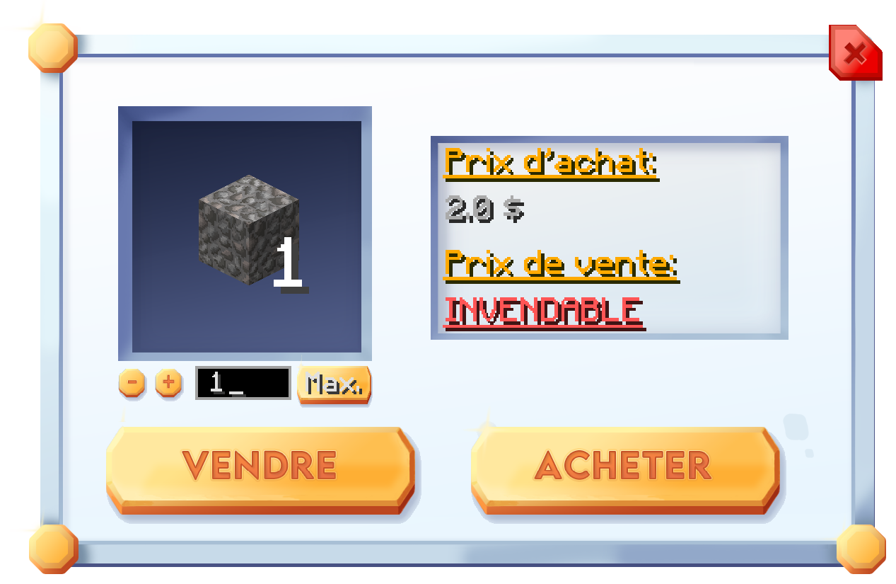

# 💳 Le magasin


L'accès au magasin n'est possible que sur le serveur Factions.


Sur Plutonia, il est possible que vous n'ayez pas toutes les ressources nécessaires pour votre aventure, il se peut aussi que vous manquiez de temps, ou que vous souhaitiez vous faire de l'argent.

Nous avons donc mis à votre disposition un magasin où vous pouvez acheter / vendre certaines ressources en échange d'une somme d'argent.

Utilisez la commande `/shop` pour y accéder. L'interface suivante s'ouvrira lorsque vous entrerez cette commande :

<figure><figcaption>
Magasin de Plutonia
</figcaption></figure>

Pour acheter ou vendre un objet, cliquez simplement dessus. Prenons le gravier comme exemple.

Quand vous cliquez sur l'objet souhaité (ici du gravier), une interface comme celle-ci s'ouvrira :

<figure><figcaption>
Interface d'achat / vente du magasin
</figcaption></figure>

Pour effectuer une transaction, saisissez la quantité souhaitée à gauche et cliquez sur le bouton `Acheter` ou `Vendre` selon votre besoin.


Effectuez la commande `/sellall` pour vendre tout le contenu de votre inventaire. Seuls les objets disponibles dans le magasin seront vendus.

