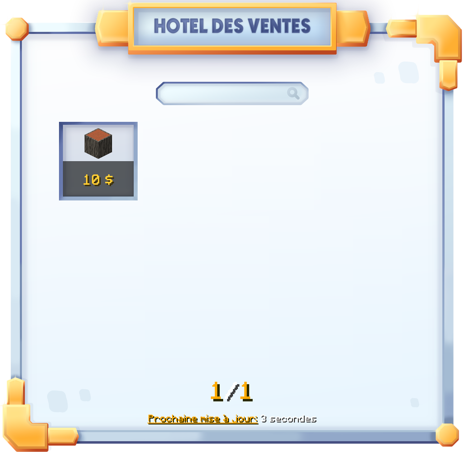
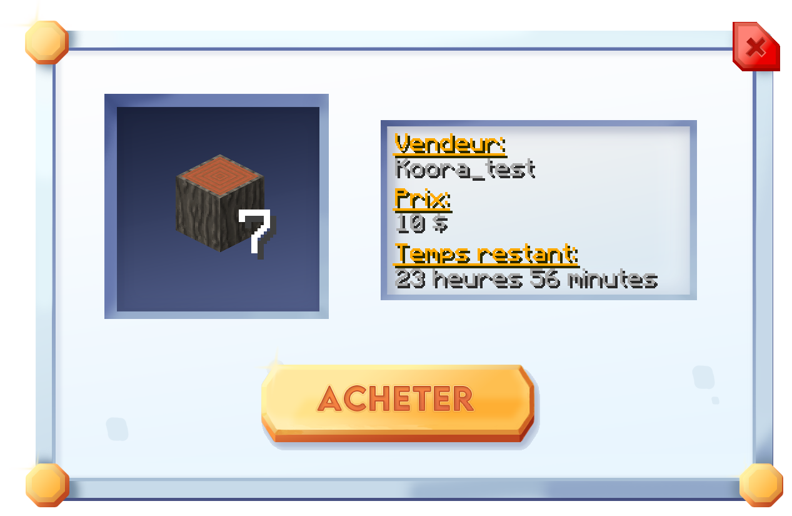
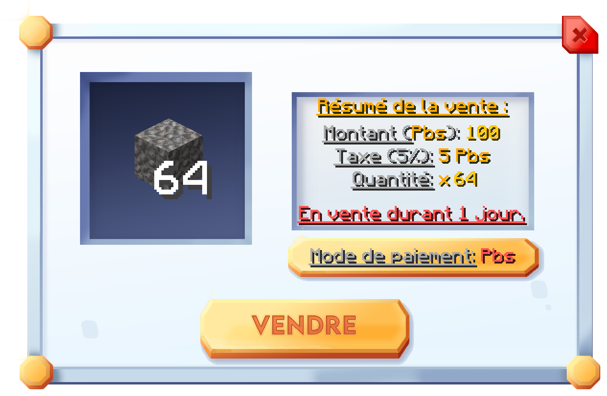

# 💱 L'hôtel des ventes

L'hôtel des ventes est indispensable pour commercer avec d'autres joueurs. Nous avons donc veillé à vous fournir une interface claire et intuitive !


L'accès à l'hôtel des ventes n'est possible que sur le serveur Factions.


### Comment y accéder ?

Pour y accéder facilement, utilisez simplement la commande `/hdv`, ou `/auction`. L'interface suivante s'ouvrira lorsque vous entrerez cette commande :

<figure><figcaption>
Hôtel des ventes de Plutonia
</figcaption></figure>

Vous retrouverez ici les offres actuelles de tous les joueurs.

### Effectuer un achat ?

Pour effectuer un achat, vous avez simplement à cliquer sur l'objet souhaité. Ici, cela sera le bois d'acacia. L'interface suivante s'ouvrira :

<figure><figcaption>
Interface d'achat de l'hôtel des ventes
</figcaption></figure>

Ici nous pouvons voir toutes les informations importantes, comme le prix, et la quantité.

Si le prix, et la quantité vous convient, vous pouvez effectuer l'achat en cliquant sur le bouton `Acheter`. S'il s'agit de votre offre, et que vous souhaitez la récupérer, il vous suffira simplement de cliquer sur le bouton `Récupérer`, qui sera présent à la place du bouton `Acheter`.

### Comment mettre en vente ?

Pour mettre un article en vente, utilisez simplement la commande `/auction sell` ou `/hdv sell`. Une interface de vente comme celle ci-dessous s'ouvrira alors.

<figure><figcaption>
Interface de vente de l'hôtel des ventes
</figcaption></figure>

Il vous suffira alors de rentrer le montant, le mode de paiement (dollars, ou points boutiques), ainsi que la quantité que vous souhaitez mettre en vente.


Une taxe de 5% est appliqué à tous les articles mis en vente, que ce soit en points boutiques, ou en dollars.


🎉 Et voilà, une fois que tout est prêt, vous n'avez qu'à cliquer sur le bouton `Vendre` pour que votre offre apparaisse pour tout le monde.
