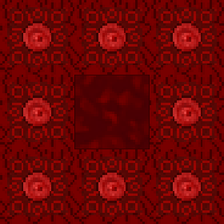

# 🩸 Rituel

### Qu'est-ce qu'un rituel ?

Cette fois-ci, ce sera plus compliqué. Le rituel est un événement qui nécessite beaucoup de ressources.

Tout d'abord, rassemblez les ressources nécessaires pour fabriquer une tête de gardien et quatre blocs de corps de gardien.


Il existe 5 types de gardiens, pour vous informer sur les différents gardiens, veuillez consulter [cette section](../gameplay/les-monstres/les-gardiens.md).


Une fois que vous avez crée les blocs nécessaire pour créer votre gardien, allez dans la zone spécialement dédiée pour le faire apparaitre. Vous pouvez y accéder grâce à la commande suivante : `/warp gardiens`. Pour le faire apparaitre, veuillez faire la même forme que pour faire apparaitre un Golem de fer.

<figure><figcaption>
Invocation d'un gardien des enfers
</figcaption></figure>


Le gardien possède 7680 points de vie, et fait 25 points de dégâts.


Pour continuer, éliminez le gardien. Soyez prudent : dès l'invocation, un message en jeu alertera tous les joueurs en ligne. Ils pourront tenter de vaincre le gardien, vous attaquer et voler votre récompense !

Une fois le gardien tué, il vous lâchera au sol l'orbe lui correspondant.


Pour accomplir les étapes suivantes, répétez cette tâche pour tous les autres gardiens. Il vous faudra une orbe de tous les types.


Une fois toutes les orbes récupérées, il vous faudra réaliser une Gemme compressée. Une fois votre Gemme compressée récupérée, il vous faudra récupérer un seau de sang, ainsi que 8 blocs de rituel.


Vous pouvez retrouver toutes les différentes recettes dans le Wiki présent en jeu.


Il vous suffira alors de réaliser une structure comme celle ci-dessous, peut importe l'endroit sur la carte. Mais attention, il faut impérativement que celle-ci soit réalisée sur le serveur Factions.

<figure><figcaption>
Structure du rituel
</figcaption></figure>


Veuillez faire attention à ce qu'il n'y ait pas de toit au dessus de la structure.


Une fois la structure réalisée, vous pouvez jeter au milieu de celle-ci votre gemme compressée. Vous devriez alors avoir une animation comme celle-ci :

<figure><figcaption>
Réalisation d'un rituel
</figcaption></figure>

🎉 Et voilà, après avoir accompli votre premier rituel, vous recevrez en récompense des pièces d'armure suprême, chacune enchantée par défaut avec `Protection 4`.
