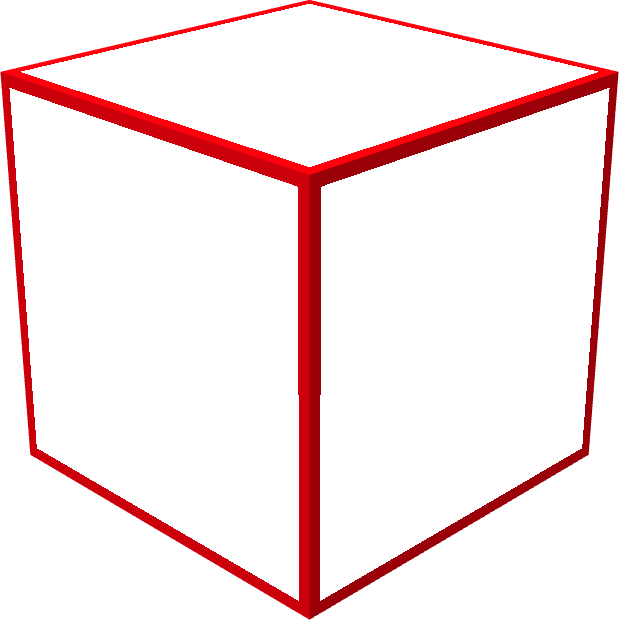
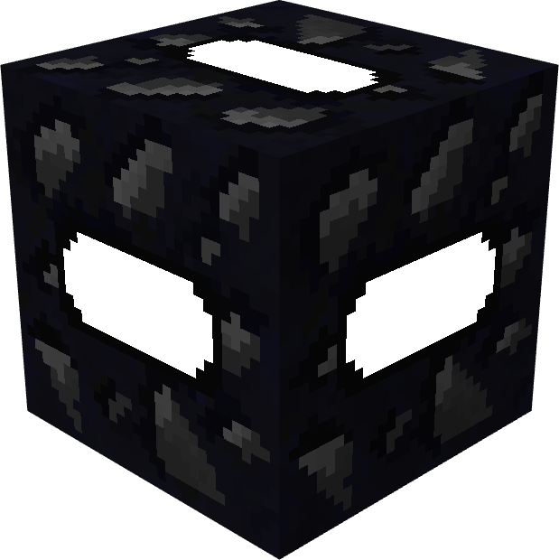
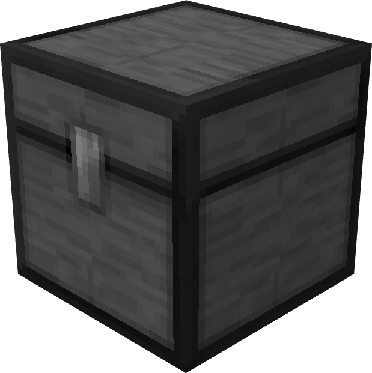
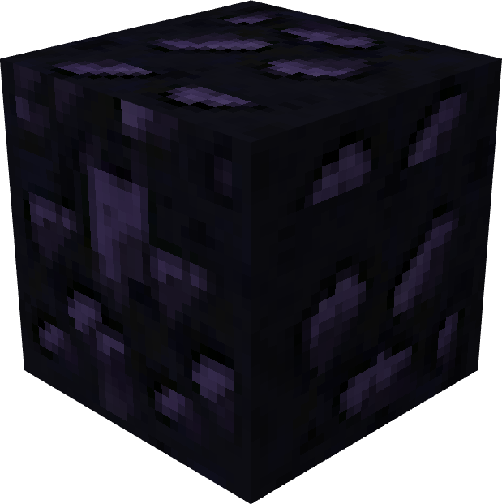

# ☁️ Autres

Le serveur possède de nombreux blocs, vous pouvez les retrouver sur cette page.

 Bloc de grotte

Le bloc de grotte permet de voir à travers les autres blocs, ce qui est pratique pour explorer ou repérer des bases cachées.

\
<mark style="color:orange;">Ajustez ces deux paramètres pour mieux voir à travers les murs :</mark>

* Cliquez sur `Options`.
* Cliquez sur `Video Settings`.
* Cliquez sur `Other`.
* Désactivez `Propagation lumineuse`, et `Optimisations des tronçons`.

 Bloc anti crash-co

Ce dispositif vous protège d'un bug connu, le `crash connexion`, et peut <mark style="color:orange;">être détruit avec de la TNT</mark>.

 Coffre en titane

Le coffre en titane offre une capacité équivalente à celle d'un double coffre, mais peut <mark style="color:orange;">être détruit par la TNT</mark>.

 Coffre en obsidienne

Le coffre en obsidienne fonctionne comme un coffre simple, mais <mark style="color:orange;">il est résistant à la TNT</mark>. Cependant, il peut toujours être <mark style="color:orange;">pillé via l'interface de piratage</mark>.


Vous pouvez vous référer au wiki disponible en jeu pour voir les différentes recettes.

