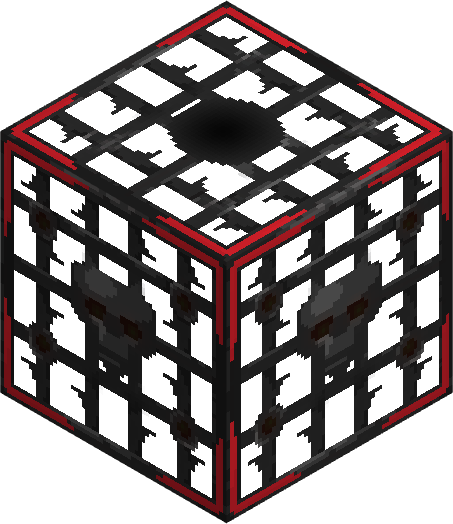
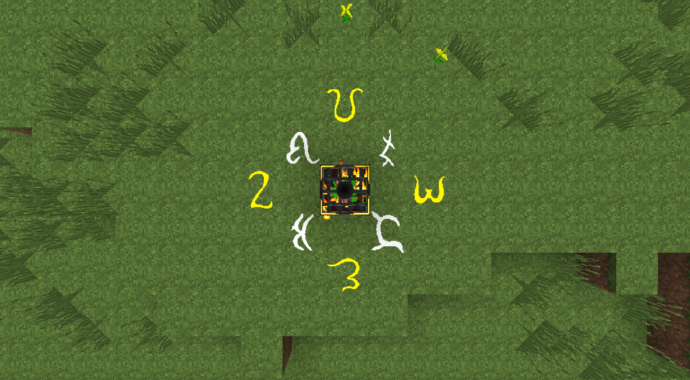

# 👾 Générateurs sombres

Le serveur dispose d'une alternative plus avancée aux générateurs normaux, les générateurs sombres !

Les générateurs sombres sont rares et complexes à obtenir. Ils se déclinent en quatre variantes : Tier 0, Tier 1, Tier 2 et Tier 3. 

## 🤔 Mais à quoi servent-ils ?

Les générateurs peuvent invoquer des Gobelins. À leur mort, ces Gobelins lâchent des yeux de Gobelins. Ces yeux permettent ensuite aux générateurs de créer des minerais.

<figure><figcaption>
Interface des générateurs sombres.
</figcaption></figure>

## 🤔 Comment les avoir ?

Pour vous en procurer, il vous faudra obtenir des `Barreaux de spawner`. Ils s'obtiennent en cassant des spawners dans le monde normal. Il vous faudra aussi des âmes. Il existe 2 types d'âmes : les âmes neutres et les âmes rares.

Vous avez 0.02% de chance d'obtenir des âmes neutres et 0.01% d'avoir des âmes rares, le tout en cassant des minerais. Il vous faudra donc bien miner ! :smile:


Pour en savoir plus, veuillez vous référer au wiki en jeu.


## 🤔 À quoi ressemblent-ils ?



<figure><figcaption>
Générateur sombre (tier 0).
</figcaption></figure>



<figure><figcaption>
Générateur sombre (tier 1).
</figcaption></figure>



<figure><figcaption>
Générateur sombre (tier 2).
</figcaption></figure>



<figure><figcaption>
Générateur sombre (tier 3).
</figcaption></figure>



## 🤔 Quelle est la structure à faire ?


La vue du haut correspond à la direction Nord.




<figure><figcaption>
Structure du générateur sombre de tier 0.
</figcaption></figure>



<figure><figcaption>
Structure du générateur sombre de tier 1.
</figcaption></figure>



<figure><figcaption>
Structure du générateur sombre de tier 2.
</figcaption></figure>



<figure><figcaption>
Structure du générateur sombre de tier 3.
</figcaption></figure>



## 🤔 Qu'est-ce qu'ils donnent ?



* Poudre de plutonium (0%)
* Lingot de mercure (5%)
* Lingot de topaze (10%)
* Lingot de titane (25%)
* Lingot d'obsidienne (60%)



* Poudre de plutonium (0.5%)
* Lingot de mercure (7.5%)
* Lingot de topaze (15%)
* Lingot de titane (27%)
* Lingot d'obsidienne (50%)



* Poudre de plutonium (2%)
* Lingot de mercure (10%)
* Lingot de topaze (17%)
* Lingot de titane (30%)
* Lingot d'obsidienne (41%)



* Poudre de plutonium (5%)
* Lingot de mercure (13%)
* Lingot de topaze (20%)
* Lingot de titane (33%)
* Lingot d'obsidienne (29%)


