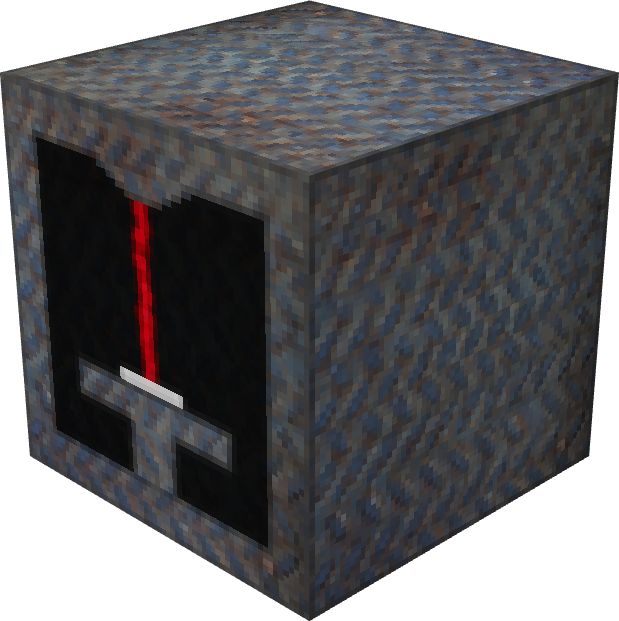
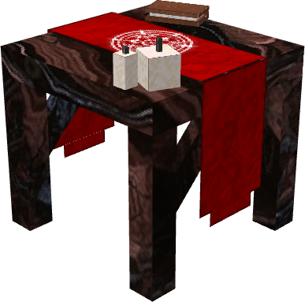
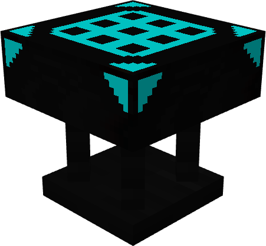
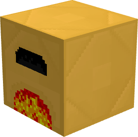
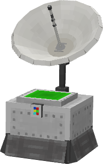

# 🔧 Machines

Le serveur possède de nouvelles machines, vous pouvez les retrouver sur cette page.

 Le décrafteur

Le décrafteur vous permet de récupérer les lingots d'une armure que vous lui donnez. <mark style="color:orange;">Son fonctionnement dépend de la durabilité de l'armure.</mark>

Par exemple, si vous introduisez des bottes en mercure avec une durabilité de 50 %, le décrafteur vous remettra 2 lingots de mercure.

 La table de désenchantement

La table de désenchantement vous permet de <mark style="color:orange;">supprimer les enchantements de l'armure que vous lui avez fournie</mark>.

<mark style="color:orange;">Une orbe de désenchantement est nécessaire à son fonctionnement.</mark>

 L'établi suprême

L'établi suprême vous permet de fabriquer de nouveaux objets avec une interface de 9 x 9.

 Le four en topaze

Le four en topaze réduit de moitié le temps de cuisson par rapport à un four traditionnel.

 L'alarme

L'alarme est un bloc qui permet de <mark style="color:orange;">vous informer via Discord</mark> si une personne est présente dans <mark style="color:orange;">un rayon de 100 blocs aux alentours</mark>.

<mark style="color:orange;">Pour qu'elle vous envoie des notifications sur Discord, il vous faudra lier votre compte à celle-ci via la commande</mark> <mark style="color:orange;"></mark><mark style="color:orange;">`/link`</mark><mark style="color:orange;">.</mark>


Vous pouvez vous référer au wiki disponible en jeu pour voir les différentes recettes.

