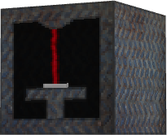

# 🔧 Machines

Le serveur possède de nouvelles machines, vous pouvez les retrouver sur cette page.

 Le décrafteur

Le décrafteur vous permet de récupérer les lingots d'une armure que vous lui donnez. Son fonctionnement dépend de la durabilité de l'armure.

Par exemple, si vous introduisez des bottes en mercure avec une durabilité de 50 %, le décrafteur vous remettra 2 lingots de mercure.

 La table de désenchantement

La table de désenchantement vous permet de supprimer les enchantements de l'armure que vous lui avez fournie.

Une orbe de désenchantement est nécessaire à son fonctionnement.

 L'établi suprême

L'établi suprême vous permet de fabriquer de nouveaux objets avec une interface de 9 x 9.

 Le four en topaze

Le four en topaze réduit de moitié le temps de cuisson par rapport à un four traditionnel.

 L'alarme

L'alarme est un bloc qui permet de vous informer via Discord si une personne est présente dans un rayon de 100 blocs aux alentours. Pour qu'elle vous envoie des notifications sur Discord, il vous faudra lier votre compte à celle-ci via la commande `/link`.


Vous pouvez vous référer au wiki disponible en jeu pour voir les différentes recettes.

