# 💎 Minerais

Le serveur possède de nouveaux minerais, vous pouvez les retrouver dans les tableaux ci-dessous.

### :thinking: Quels sont les différents minerais ?

 Minerai d'expérience aléatoire

Le minerai d'expérience fait parti des minerais les moins rares du serveur et se classe à la <mark style="color:orange;">position 2 / 8 sur l'échelle de rareté</mark>.\
\
Échelle de rareté : Obsidienne > <mark style="color:orange;">Expérience</mark> > Aléatoire > Titane > Topaze > Mercure > Minerais élémentaires > Plutonium.

Situé entre les couches 2 et 15, ce minerai permet de récupérer de l'expérience lorsqu'il est miné. Le nombre de minerais par filon est compris entre 1 minerai et 4 minerais.

<mark style="color:orange;">Le minerai d'expérience est fortunable. Cela signifie que l'utilisation de l'enchantement Fortune I / II / III permet de récupérer plus d'expérience lorsque le minerai est miné.</mark>

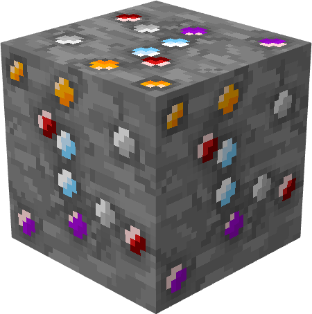 Minerai aléatoire

Le minerai aléatoire est le troisième minerai le moins rare du serveur et se classe à la <mark style="color:orange;">position 3 / 8 sur l'échelle de rareté</mark>.\
\
Échelle de rareté : Obsidienne > Expérience > <mark style="color:orange;">Aléatoire</mark> > Titane > Topaze > Mercure > Minerais élémentaires > Plutonium.

Situé entre les couches 2 et 8, ce minerai permet de récupérer un minerai aléatoire parmi tous les minerais disponibles sur le serveur. Le nombre de minerais par filon est compris entre 1 minerai et 3 minerais.

<mark style="color:orange;">Le minerai d'aléatoire est fortunable. Cela signifie que l'utilisation de l'enchantement Fortune I / II / III permet de récupérer plus de minerais lorsque le minerai est miné.</mark>

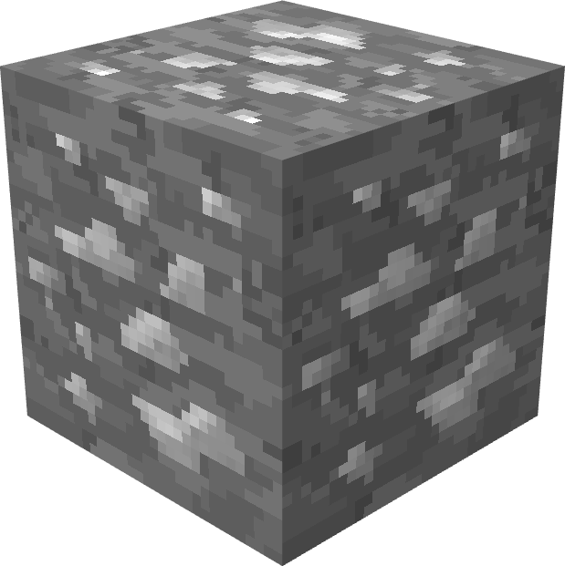 Minerai de titane

Le minerai de titane est le quatrième minerai le plus rare du serveur et se classe à la <mark style="color:orange;">position 4 / 8 sur l'échelle de rareté</mark>.\
\
Échelle de rareté : Obsidienne > Expérience > Aléatoire > <mark style="color:orange;">Titane</mark> > Topaze > Mercure > Minerais élémentaires > Plutonium.

Situé entre les couches 2 et 15, ce minerai permet de récupérer du titane lorsqu'il est miné. Le nombre de minerais par filon est compris entre 1 minerai et 4 minerais.

<mark style="color:orange;">Le minerai de titane est fortunable. Cela signifie que l'utilisation de l'enchantement Fortune I / II / III permet de récupérer plus de titane lorsque le minerai est miné.</mark>

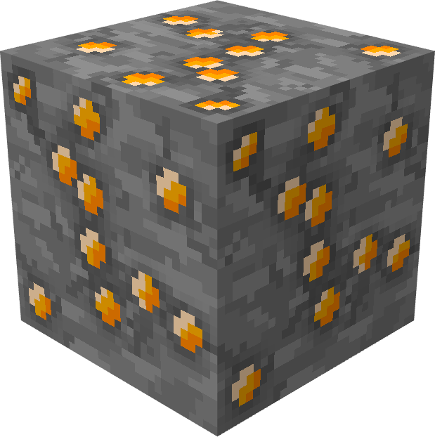 Minerai de topaze

Le minerai de topaze fait parti des minerais les plus rares du serveur et se classe à la <mark style="color:orange;">position 5 / 8 sur l'échelle de rareté</mark>.\
\
Échelle de rareté : Obsidienne > Expérience > Aléatoire > Titane > <mark style="color:orange;">Topaze</mark> > Mercure > Minerais élémentaires > Plutonium.

Situé entre les couches 2 et 15, ce minerai permet de récupérer du topaze lorsqu'il est miné. Le nombre de minerais par filon est compris entre 1 minerai et 4 minerais.

<mark style="color:orange;">Le minerai de topaze est fortunable. Cela signifie que l'utilisation de l'enchantement Fortune I / II / III permet de récupérer plus de topaze lorsque le minerai est miné.</mark>

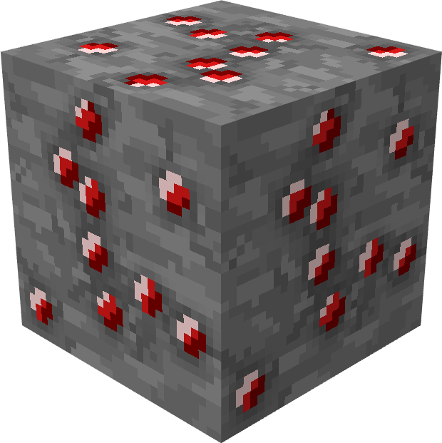 Minerai de mercure

Le minerai de mercure est le deuxième minerai le plus rares du serveur et se classe à la <mark style="color:orange;">position 6 / 8 sur l'échelle de rareté</mark>.\
\
Échelle de rareté : Obsidienne > Expérience > Aléatoire > Titane > Topaze > <mark style="color:orange;">Mercure</mark> > Minerais élémentaires > Plutonium.

Situé entre les couches 2 et 8, ce minerai permet de récupérer du mercure lorsqu'il est miné. Le nombre de minerais par filon est compris entre 1 minerai et 4 minerais.

<mark style="color:orange;">Le minerai de mercure n'est pas fortunable. Cela signifie que l'utilisation de l'enchantement Fortune I / II / III ne permet pas de récupérer plus de mercure lorsque le minerai est miné.</mark>

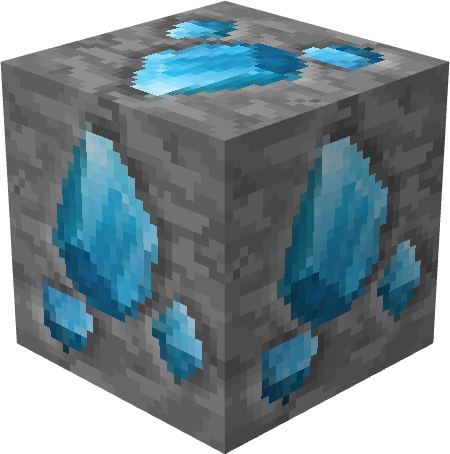 Minerais élémentaires

Les minerais élémentaires sont des minerais spéciaux, ils sont plus rares que le mercure, et se trouvent à des endroits différents.

Tous les minerais, à l'exception du minerai des astres, et des enfers, se trouvent dans le [monde Minage](../../mondes/minages.md). Le minerai des astres est présent sur le [monde de l'End](../../mondes/end.md), et le minerai des enfers est présent dans le [monde du Nether](../../mondes/nether.md).

Échelle de rareté : Obsidienne > Expérience > Aléatoire > Titane > Topaze > Mercure > <mark style="color:orange;">Minerais élémentaires</mark> > Plutonium.

Situé entre les couches 0 et 60, ces minerais permettent de récupérer aléatoirement en fonction de leur élément une partie du cœur d'un gardien lorsqu'ils sont minés. Il n'y a qu'un seul minerai par filon.

<mark style="color:orange;">Les minerais élémentaires ne sont pas fortunables, sauf avec la</mark> [<mark style="color:orange;">pioche suprême</mark>](../les-objets/outils.md#pioche-5)<mark style="color:orange;">.</mark>

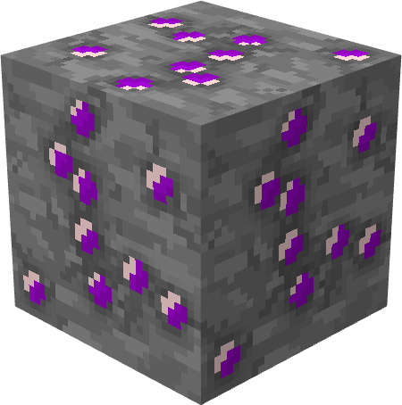 Minerai de plutonium

Le minerai de plutonium est le minerai le plus rare du serveur et se classe à la <mark style="color:orange;">position 8 / 8 sur l'échelle de rareté</mark>.\
\
Échelle de rareté : Obsidienne > Expérience > Aléatoire > Titane > Topaze > Mercure > Minerais élémentaires > <mark style="color:orange;">Plutonium</mark>.

Situé seulement entre les couches 2 et 8 dans le biome Extreme Hills, ce minerai permet de récupérer du plutonium lorsqu'il est miné. Le nombre de minerais par filon est compris entre 1 minerai et 2 minerais.

<mark style="color:orange;">Le minerai de plutonium n'est pas fortunable. Cela signifie que l'utilisation de l'enchantement Fortune I / II / III ne permet pas de récupérer plus de plutonium lorsque le minerai est miné.</mark>

### :thinking: Quels sont les différents blocs ?

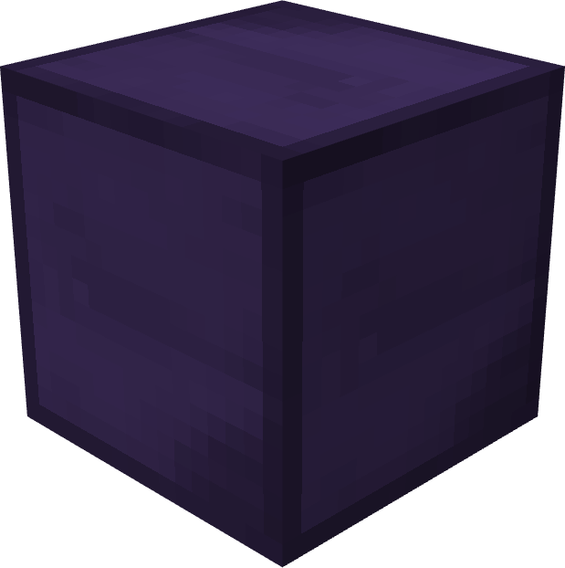 Bloc d'obsidienne

Pour créer un bloc d'obsidienne, placez 9 lingots d'obsidienne dans un établi. Il peut être cassé avec de la TNT et miné comme un bloc normal.

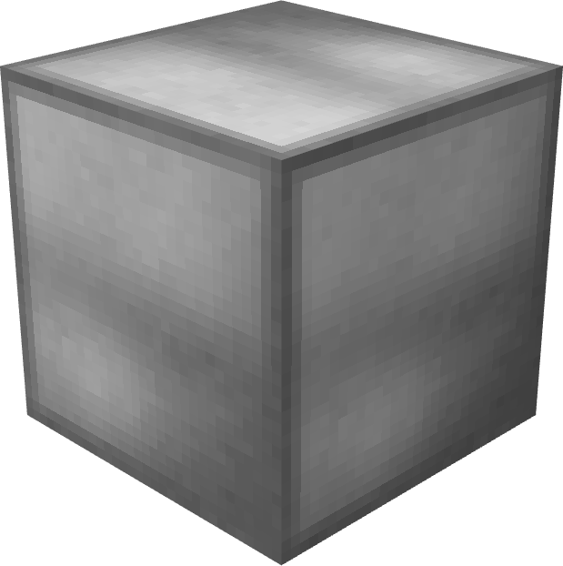 Bloc de titane

Un bloc de titane se fabrique en combinant 9 titanes dans un établi. Il peut être détruit à la TNT et se mine comme un bloc normal.

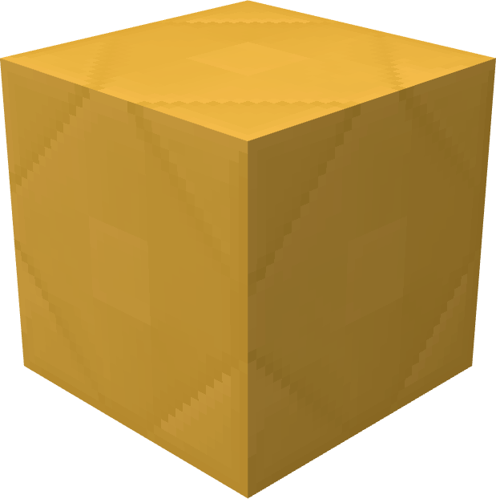 Bloc de topaze

Un bloc de topaze se fabrique en combinant 9 topazes dans un établi. Il peut être détruit à la TNT et se mine comme un bloc normal.

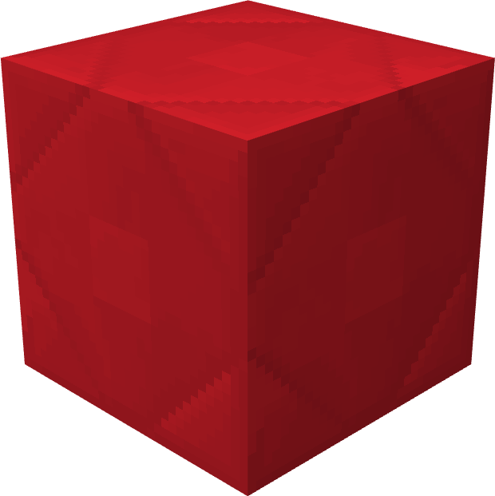 Bloc de mercure

Un bloc de mercure se fabrique en combinant 9 mercures dans un établi. Il peut être détruit à la TNT et se mine comme un bloc normal.

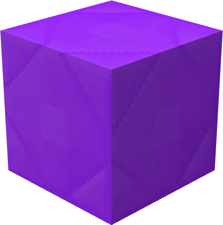 Bloc de plutonium

Un bloc de plutonium se fabrique en combinant 9 lingots de plutonium dans un établi. Il peut être détruit à la TNT et se mine comme un bloc normal.

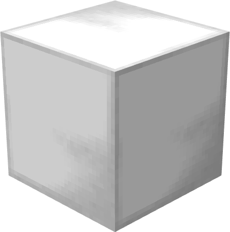 Bloc de fer raffiné

Un bloc de fer raffiné se fabrique en combinant 9 lingots de fer raffiné dans un établi. Il peut être détruit à la TNT et se mine comme un bloc normal.


Vous pouvez vous référer au wiki disponible en jeu pour voir les différentes recettes.

