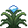
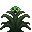

# 🌼 Plantations

Le serveur possède de nouvelles agricultures, vous pouvez les retrouver dans le tableau ci-dessous.

 Graines de résistance au feu

La graine de résistance au feu prend <mark style="color:orange;">trois fois plus de temps à pousser</mark> que du blé.\
Une fois récoltée, elle vous donne une <mark style="color:orange;">essence de résistance au feu</mark>, celle-ci permet de créer un cookie de résistance au feu.

 Graines de force

La graine de force prend <mark style="color:orange;">trois fois plus de temps à pousser</mark> que du blé.\
Une fois récoltée, elle vous donne une <mark style="color:orange;">essence de force</mark>, celle-ci permet de créer un cookie de force.

 Graines de régénération

La graine de régénération prend <mark style="color:orange;">trois fois plus de temps à pousser</mark> que du blé.\
Une fois récoltée, elle vous donne une <mark style="color:orange;">essence de régénération</mark>, celle-ci permet de créer un cookie de régénération.

 Graines d'anti chute

La graine d'anti chute prend <mark style="color:orange;">trois fois plus de temps à pousser</mark> que du blé.\
Une fois récoltée, elle vous donne une <mark style="color:orange;">essence d'anti chute</mark>, celle-ci permet de créer un cookie d'anti chute.

 Graines de Creeper

La graine de Creeper prend <mark style="color:orange;">dix fois plus de temps à pousser</mark> que du blé.\
Une fois récoltée, elle vous donne une <mark style="color:orange;">essence de Creeper</mark>, celle-ci permet de créer un sceptre de Creeper.

 Plantation de mercure

La plantation de mercure prend <mark style="color:orange;">huit fois plus de temps à pousser</mark> que du blé, une fois récoltée, elle vous donne une <mark style="color:orange;">pépite de mercure</mark>.

 Plantation de plutonium

La plantation de plutonium prend <mark style="color:orange;">huit fois plus de temps à pousser</mark> que du blé, une fois récoltée, elle vous donne une <mark style="color:orange;">pépite de plutonium</mark>.


Les graines peuvent être achetées dans le marché (/shop) du serveur ou récupérer dans les caisses. (/warp caisses)

