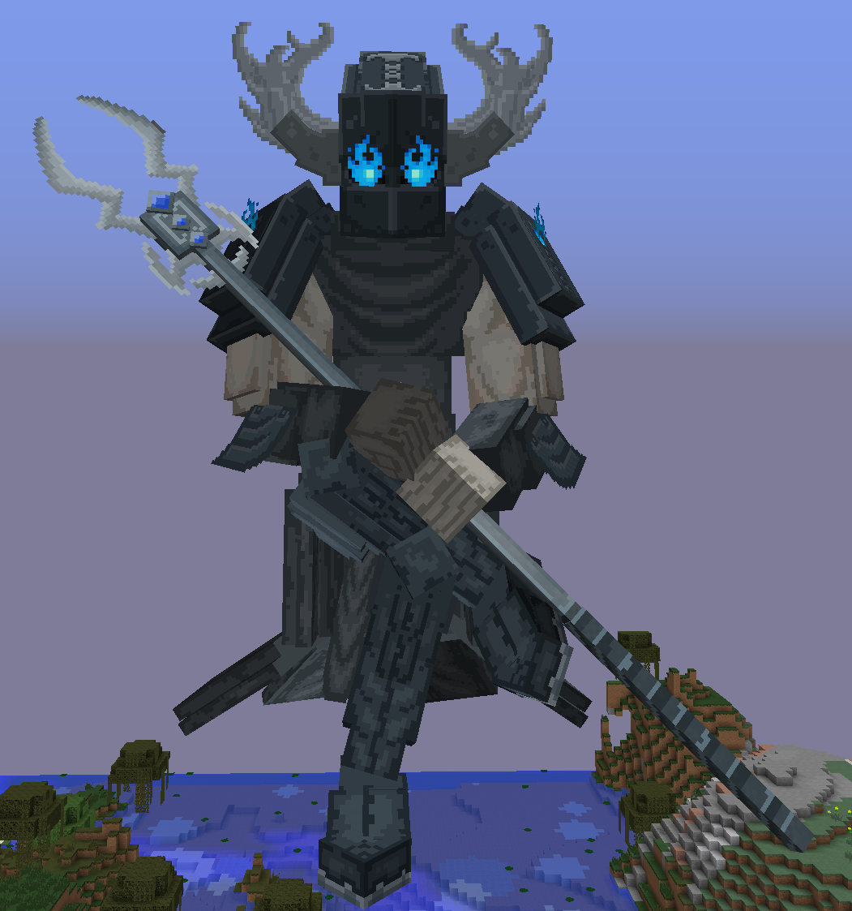
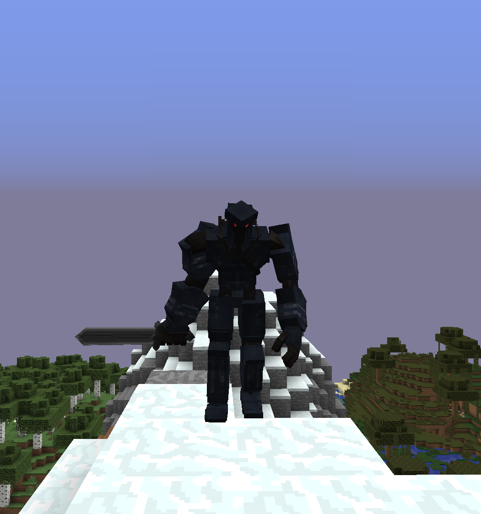

# ⭕ Hadès

### Qu'est-ce qu'Hadès ?

Hades est un monstre hostile, et <mark style="color:orange;">est considéré comme un boss</mark>. Celui-ci n'apparaît que dans le [monde de l'End](../../mondes/end.md).

Hadès, ce monstre redoutable, réside dans les donjons. Cet adversaire agressif <mark style="color:orange;">invoque des sbires à chaque fois qu'il perd 30 % de sa santé</mark>. Il est très dangereux, infligeant <mark style="color:orange;">50 dégâts d'attaque</mark>, avec <mark style="color:orange;">10 240 points de vie</mark>, et possède une <mark style="color:orange;">vitesse exceptionnelle</mark>.

<figure><figcaption>
Image d'Hadès
</figcaption></figure>

### Qui sont ses sbires ?

Ses sbires portent le nom de Chevaliers. Ces monstres sont tout autant hostiles qu'Hadès, mais font moins de dégâts que ce dernier.

Il font seulement <mark style="color:orange;">20 dégâts d'attaque</mark>, et ont seulement <mark style="color:orange;">1024 points de vie</mark>.

<figure><figcaption>
Image d'un chevalier
</figcaption></figure>

### Quelle est la récompense quand on arrive à le tuer ?

<mark style="color:red;">En cours de rédaction.</mark>
