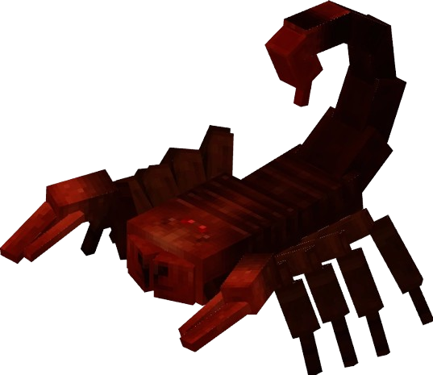

# 🦂 Scorpion

Lorsqu'il est tué, il y a <mark style="color:orange;">30% de chances</mark> de récupérer une carapace de scorpion, qui peut être utilisée pour divers recettes. <mark style="color:orange;">Les scorpions se trouvent principalement dans les déserts, et sont très communs.</mark>

Ils infligent 5 de dégâts, et ont 25% de chance de vous donner l'effet `Poison I` pendant 5 secondes.

<figure><figcaption>
Image d'un scorpion trouvé dans la nature
</figcaption></figure>
