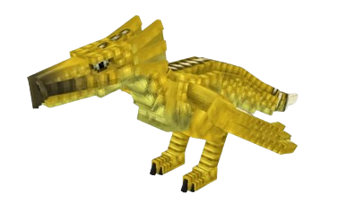

# 🦅 Wyvern

La Wyvern est une <mark style="color:orange;">monture volante</mark>, qui est uniquement disponible en réalisant la quête `Triomphateur total`. Elle peut être invoquée en utilisant la commande `/wyvern`.

Cependant, elle n'est pas utilisable dans la WarZone. Il y a 12 couleurs disponibles pour votre Wyvern, celle-ci est choisie aléatoirement quand vous l'obtenez.

<figure><figcaption>
Image d'une Wyvern
</figcaption></figure>


Une fois que vous avez obtenu votre Wyvern, vous ne pouvez pas la perdre lors de la version.

