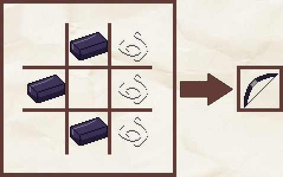
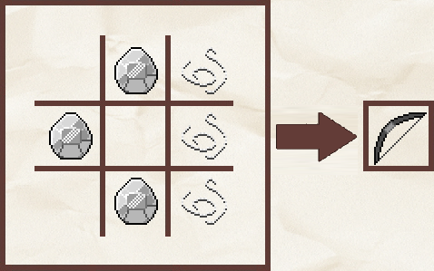
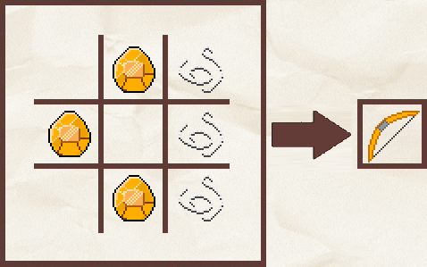
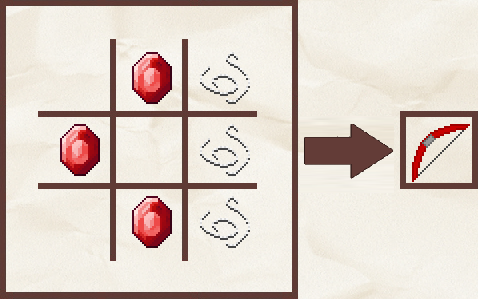
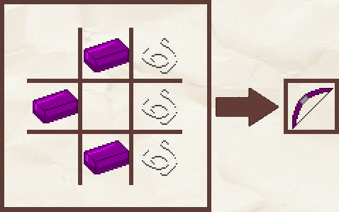
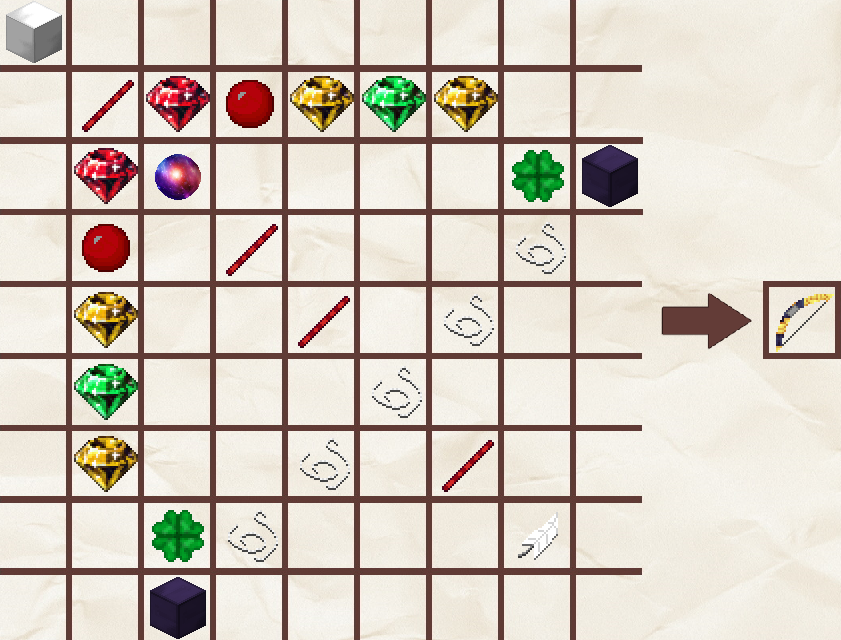

# 🏹 Arcs

Le serveur possède de nouveaux arcs, vous pouvez les retrouver dans le tableau ci-dessous.



L'arc en obsidienne est une arme créée par Plutonia. Il est plus résistant que l'arc classique de Minecraft.

Les caractéristiques de cet arc sont les suivantes : \
&#x20;     \- Durabilité : <mark style="color:orange;">**500**</mark>\
&#x20;     \- Dégâts : <mark style="color:orange;">**+2**</mark>

Les ingrédients nécessaires à sa réalisation sont les suivants :\
&#x20;     \- <mark style="color:orange;">**Lingot d'obsidienne (x3)**</mark>\
&#x20;     \- <mark style="color:orange;">**Ficelle (x3)**</mark>

L'arc en obsidienne peut être créé en suivant le pattern ci-dessous :&#x20;

<figure><figcaption>
Recette de l'arc en obsidienne
</figcaption></figure>



L'arc en titane est une arme créée par Plutonia. Cet arc est plus résistant que l'arc en obsidienne.

Les caractéristiques de cet arc sont les suivantes : \
&#x20;     \- Durabilité : <mark style="color:orange;">**1000**</mark>\
&#x20;     \- Dégâts : <mark style="color:orange;">**+2**</mark>

Les ingrédients nécessaires à sa réalisation sont les suivants :\
&#x20;     \- <mark style="color:orange;">**Lingot de titane (x3)**</mark>\
&#x20;     \- <mark style="color:orange;">**Ficelle (x3)**</mark>

L'arc en titane peut être créé en suivant le pattern ci-dessous :&#x20;

<figure><figcaption>
Recette de l'arc en titane 
</figcaption></figure>



L'arc en topaze est une arme créée par Plutonia. Cet arc est plus résistant que l'arc en titane.

Les caractéristiques de cet arc sont les suivantes : \
&#x20;     \- Durabilité : <mark style="color:orange;">**1500**</mark>\
&#x20;     \- Dégâts : <mark style="color:orange;">**+2**</mark>

Les ingrédients nécessaires à sa réalisation sont les suivants :\
&#x20;     \- <mark style="color:orange;">**Lingot de topaze (x3)**</mark>\
&#x20;     \- <mark style="color:orange;">**Ficelle (x3)**</mark>

L'arc en topaze peut être créé en suivant le pattern ci-dessous :&#x20;

<figure><figcaption>
Recette de l'arc en topaze
</figcaption></figure>



L'arc en mercure est une arme créée par Plutonia. Cet arc est plus résistant que l'arc en topaze.

Les caractéristiques de cet arc sont les suivantes : \
&#x20;     \- Durabilité : <mark style="color:orange;">**2000**</mark>\
&#x20;     \- Dégâts : <mark style="color:orange;">**+2**</mark>

Les ingrédients nécessaires à sa réalisation sont les suivants :\
&#x20;     \- <mark style="color:orange;">**Lingot de mercure (x3)**</mark>\
&#x20;     \- <mark style="color:orange;">**Ficelle (x3)**</mark>

L'arc en mercure peut être créé en suivant le pattern ci-dessous :&#x20;

<figure><figcaption>
Recette de l'arc en mercure
</figcaption></figure>



L'arc en plutonium est une arme créée par Plutonia. Cet arc est plus résistant que l'arc en mercure.

Les caractéristiques de cet arc sont les suivantes : \
&#x20;     \- Durabilité : <mark style="color:orange;">**2500**</mark>\
&#x20;     \- Dégâts : <mark style="color:orange;">**+2**</mark>

Les ingrédients nécessaires à sa réalisation sont les suivants :\
&#x20;     \- <mark style="color:orange;">**Lingot de plutonium (x3)**</mark>\
&#x20;     \- <mark style="color:orange;">**Ficelle (x3)**</mark>

L'arc en plutonium peut être créé en suivant le pattern ci-dessous :&#x20;

<figure><figcaption>
Recette de l'arc en plutonium
</figcaption></figure>



L'arc suprême est une arme à distance unique créée par Plutonia. Cet arc est plus résistant que tous les autres arcs disponibles et permet de se téléporter sur le monstre / joueur touché par votre flèche.

Les caractéristiques de cet arc sont les suivantes : \
&#x20;     \- Durabilité : <mark style="color:orange;">**3000**</mark>\
&#x20;     \- Dégâts : <mark style="color:orange;">**+2**</mark>

Les ingrédients nécessaires à sa réalisation sont les suivants :\
&#x20;     \- <mark style="color:orange;">**Bloc de fer raffiné (x1)**</mark>\
&#x20;     \- <mark style="color:orange;">**Bloc d'obsidienne (x2)**</mark>\
&#x20;     \- <mark style="color:orange;">**Bâton de mercure (x4)**</mark>\
&#x20;     \- <mark style="color:orange;">**Ficelle (x5)**</mark>\
&#x20;     \- <mark style="color:orange;">**Plume (x1)**</mark>\
&#x20;     \- <mark style="color:orange;">**Mercure raffiné (x2)**</mark>\
&#x20;     \- <mark style="color:orange;">**Topaze raffiné (x4)**</mark>\
&#x20;     \- <mark style="color:orange;">**Émeraude raffiné (x2)**</mark>\
&#x20;     \- <mark style="color:orange;">**Sang coagulé (x2)**</mark>\
&#x20;     \- <mark style="color:orange;">**Trèfle (x2)**</mark>

L'épée suprême peut être créé en suivant le pattern ci-dessous :&#x20;

<figure><figcaption>
Recette de l'arc suprême
</figcaption></figure>


Contrairement à l'ensemble des autres arcs, il est nécessaire d'utiliser [l'établi suprême](../les-blocs/machines.md#letabli-supreme) pour créer l'arc suprême.



