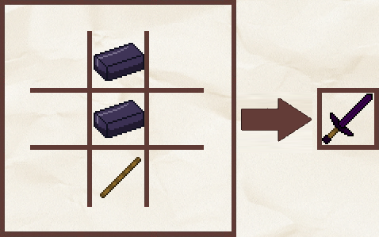
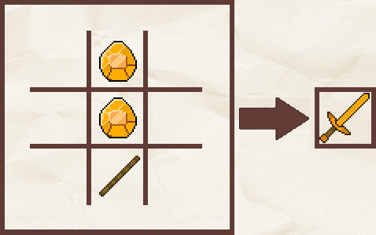
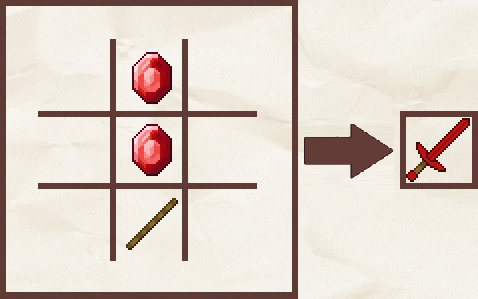
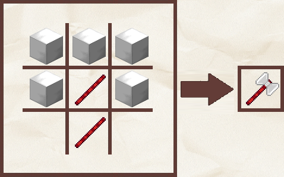
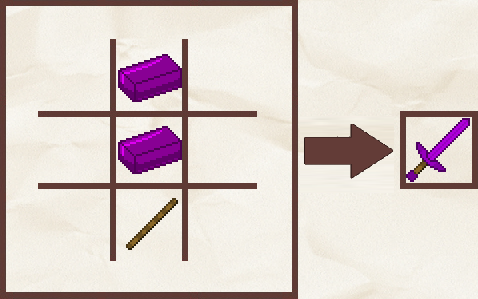
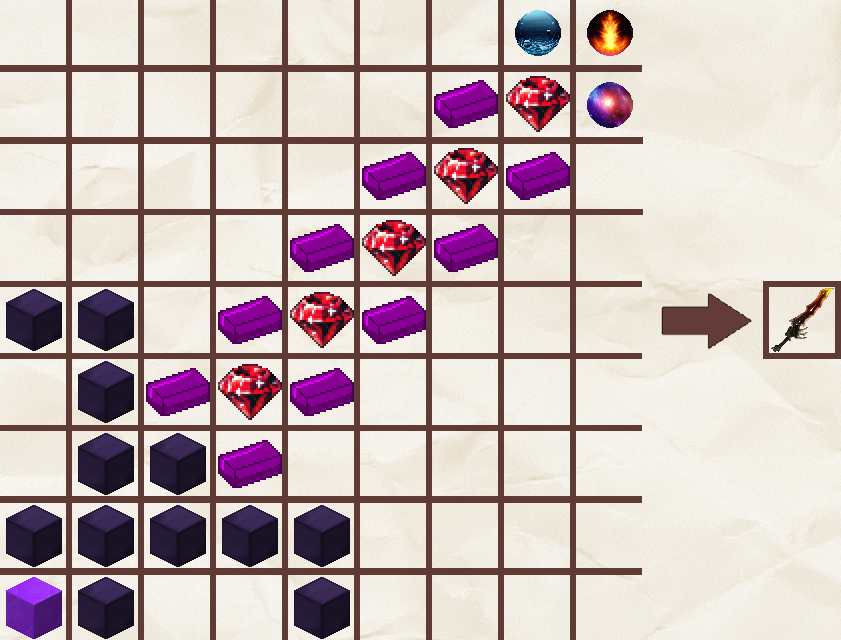

# 🔪 Armes

Le serveur possède de nouvelles armes, vous pouvez les retrouver dans le tableau ci-dessous.



L'épée en obsidienne est une arme créée par Plutonia. Elle est plus puissante que l'épée en diamant classique de Minecraft.

Les caractéristiques de l'épée en obsidienne sont les suivantes : \
&#x20;     \- Durabilité : <mark style="color:orange;">**2000**</mark>\
&#x20;     \- Dégats : <mark style="color:orange;">**+7**</mark>

Les ingrédients nécessaires au craft de l'épée en obsidienne sont les suivants :\
&#x20;     \- <mark style="color:orange;">**Lingot d'obsidienne (x2)**</mark>\
&#x20;     \- <mark style="color:orange;">**Bâton (x1)**</mark>

L'épée en obsidienne peut être créée en suivant le craft ci-dessous :&#x20;

<figure><figcaption>
Craft de l'épée en obsidienne
</figcaption></figure>

L'épée en obsidienne est également disponible dans le kit guerrier sur le serveur faction via la commande `/kit guerrier` .



L'épée en titane est une arme créée par Plutonia. Elle est plus puissante que l'épée en obsidienne.

Les caractéristiques de l'épée en titane sont les suivantes : \
&#x20;     \- Durabilité : <mark style="color:orange;">**2500**</mark>\
&#x20;     \- Dégats : <mark style="color:orange;">**+8**</mark>

Les ingrédients nécessaires au craft de l'épée en titane sont les suivants :\
&#x20;     \- <mark style="color:orange;">**Titane (x2)**</mark>\
&#x20;     \- <mark style="color:orange;">**Bâton (x1)**</mark>

L'épée en titane peut être créée en suivant le craft ci-dessous :&#x20;

<figure><figcaption>
Craft de l'épée en titane
</figcaption></figure>

L'épée en titane est également disponible dans le kit paladin achetable sur [notre boutique](https://plutonia-mc.fr/shop/categories/grades) et récupérable le serveur faction via la commande `/kit paladin` .



L'épée en topaze est une arme créée par Plutonia. Elle est plus puissante que l'épée en titane.

Les caractéristiques de l'épée en topaze sont les suivantes : \
&#x20;     \- Durabilité : <mark style="color:orange;">**3000**</mark>\
&#x20;     \- Dégats : <mark style="color:orange;">**+9**</mark>

Les ingrédients nécessaires au craft de l'épée en topaze sont les suivants :\
&#x20;     \- <mark style="color:orange;">**Topaze (x2)**</mark>\
&#x20;     \- <mark style="color:orange;">**Bâton (x1)**</mark>

L'épée en topaze peut être créée en suivant le craft ci-dessous :&#x20;

<figure><figcaption>
Craft de l'épée en topaze
</figcaption></figure>

L'épée en topaze est également disponible dans le kit légendaire achetable sur [notre boutique](https://plutonia-mc.fr/shop/categories/grades) et récupérable le serveur faction via la commande `/kit legendaire` .



L'épée en mercure est une arme créée par Plutonia. Elle est plus puissante que l'épée en topaze.

Les caractéristiques de l'épée en mercure sont les suivantes : \
&#x20;     \- Durabilité : <mark style="color:orange;">**3500**</mark>\
&#x20;     \- Dégats : <mark style="color:orange;">**+10**</mark>

Les ingrédients nécessaires au craft de l'épée en mercure sont les suivants :\
&#x20;     \- <mark style="color:orange;">**Mercure (x2)**</mark>\
&#x20;     \- <mark style="color:orange;">**Bâton (x1)**</mark>

L'épée en mercure peut être créée en suivant le craft ci-dessous :&#x20;

<figure><figcaption>
Craft de l'épée en mercure
</figcaption></figure>

L'épée en mercure est également disponible dans le kit seigneur achetable sur [notre boutique](https://plutonia-mc.fr/shop/categories/grades) et récupérable le serveur faction via la commande `/kit seigneur` .



La hache de combat est une arme créée par Plutonia. Elle est plus puissante que l'épée en mercure.

Les caractéristiques de la hache de combat sont les suivantes : \
&#x20;     \- Durabilité : <mark style="color:orange;">**4500**</mark>\
&#x20;     \- Dégats : <mark style="color:orange;">**+11**</mark>

Les ingrédients nécessaires au craft de la hache de combat sont les suivants :\
&#x20;     \- <mark style="color:orange;">**Bloc de fer raffiné (x5)**</mark>\
&#x20;     \- <mark style="color:orange;">**Bâton en mercure (x1)**</mark>

La hache de combat peut être créée en suivant le craft ci-dessous :&#x20;

<figure><figcaption>
Craft de la hache de combat
</figcaption></figure>



L'épée en plutonium est une arme créée par Plutonia. Elle est plus puissante que l'épée en mercure.

Les caractéristiques de l'épée suprême sont les suivantes : \
&#x20;     \- Durabilité : <mark style="color:orange;">**4000**</mark>\
&#x20;     \- Dégats : <mark style="color:orange;">**+12**</mark>

Les ingrédients nécessaires au craft de l'épée en plutonium sont les suivants :\
&#x20;     \- <mark style="color:orange;">**Lingot de plutonium (x2)**</mark>\
&#x20;     \- <mark style="color:orange;">**Bâton (x1)**</mark>

L'épée en plutonium peut être créée en suivant le craft ci-dessous :&#x20;

<figure><figcaption>
Craft de l'épée en plutonium
</figcaption></figure>



L'épée en plutonium est une arme créée par Plutonia. Elle est plus puissante que la hache de combat.

Les caractéristiques de l'épée en plutonium sont les suivantes : \
&#x20;     \- Durabilité : <mark style="color:orange;">**5000**</mark>\
&#x20;     \- Dégats : <mark style="color:orange;">**+13**</mark>

Les ingrédients nécessaires au craft de l'épée suprême sont les suivants :\
&#x20;     \- <mark style="color:orange;">**Bloc de plutonium (x1)**</mark>\
&#x20;     \- <mark style="color:orange;">**Bloc d'obsidienne (x12)**</mark>\
&#x20;     \- <mark style="color:orange;">**Plutonium (x10)**</mark>\
&#x20;     \- <mark style="color:orange;">**Mercure raffiné (x5)**</mark>\
&#x20;     \- <mark style="color:orange;">**Orbe de l'eau (x1)**</mark>\
&#x20;     \- <mark style="color:orange;">**Orbe du feu (x1)**</mark>\
&#x20;     \- <mark style="color:orange;">**Orbe des astres (x1)**</mark>&#x20;

L'épée suprême peut être créée en suivant le craft ci-dessous :&#x20;

<figure><figcaption>
Craft de l'épée suprême
</figcaption></figure>


Contrairement à l'ensemble des autres armes, il est nécessaire d'utiliser l'[établi suprême](../les-blocs/machines.md#first-tab) pour créer l'épée suprême.




