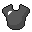
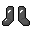
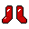
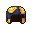
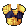
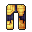
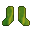

# 🤺 Armures

Le serveur possède de nouvelles armures, vous pouvez les retrouver dans le tableau ci-dessous.



## Casque : 

Durabilité : <mark style="color:orange;">550</mark>

Puissance : <mark style="color:orange;">1 / 6</mark>

## Plastron : 

Durabilité : <mark style="color:orange;">800</mark>

Puissance : <mark style="color:orange;">1 / 6</mark>

## Jambières : 

Durabilité : <mark style="color:orange;">750</mark>

Puissance : <mark style="color:orange;">1 / 6</mark>

## Bottes : 

Durabilité : <mark style="color:orange;">650</mark>

Puissance : <mark style="color:orange;">1 / 6</mark>



## Casque : 

Durabilité : <mark style="color:orange;">660</mark>

Puissance : <mark style="color:orange;">2 / 6</mark>

## Plastron : 

Durabilité : <mark style="color:orange;">960</mark>

Puissance : <mark style="color:orange;">2 / 6</mark>

## Jambières : 

Durabilité : <mark style="color:orange;">900</mark>

Puissance : <mark style="color:orange;">2 / 6</mark>

## Bottes : 

Durabilité : <mark style="color:orange;">780</mark>

Puissance : <mark style="color:orange;">2 / 6</mark>



## Casque : 

Durabilité : <mark style="color:orange;">660</mark>

Puissance : <mark style="color:orange;">3 / 6</mark>

## Plastron : 

Durabilité : <mark style="color:orange;">960</mark>

Puissance : <mark style="color:orange;">3 / 6</mark>

## Jambières : 

Durabilité : <mark style="color:orange;">900</mark>

Puissance : <mark style="color:orange;">3 / 6</mark>

## Bottes : 

Durabilité : <mark style="color:orange;">780</mark>

Puissance : <mark style="color:orange;">3 / 6</mark>



## Casque : 

Durabilité : <mark style="color:orange;">770</mark>

Puissance : <mark style="color:orange;">4 / 6</mark>

## Plastron : 

Durabilité : <mark style="color:orange;">1120</mark>

Puissance : <mark style="color:orange;">4 / 6</mark>

## Jambières : 

Durabilité : <mark style="color:orange;">1050</mark>

Puissance : <mark style="color:orange;">4 / 6</mark>

## Bottes : 

Durabilité : <mark style="color:orange;">910</mark>

Puissance : <mark style="color:orange;">4 / 6</mark>



## Casque : 

Durabilité : <mark style="color:orange;">880</mark>

Puissance : <mark style="color:orange;">5 / 6</mark>

## Plastron : 

Durabilité : <mark style="color:orange;">1280</mark>

Puissance : <mark style="color:orange;">5 / 6</mark>

## Jambières : 

Durabilité : <mark style="color:orange;">1200</mark>

Puissance : <mark style="color:orange;">5 / 6</mark>

## Bottes : 

Durabilité : <mark style="color:orange;">1040</mark>

Puissance : <mark style="color:orange;">5 / 6</mark>


Une fois l'armure totalement équipée, celle-ci vous donne les effets suivants :

* Rapidité II.
* Force II.
* Anti chute.
* Résistance au feu.




## Casque : 

Durabilité : <mark style="color:orange;">990</mark>

Puissance : <mark style="color:orange;">6 / 6</mark>

## Plastron : 

Durabilité : <mark style="color:orange;">1440</mark>

Puissance : <mark style="color:orange;">6 / 6</mark>

## Jambières : 

Durabilité : <mark style="color:orange;">1350</mark>

Puissance : <mark style="color:orange;">6 / 6</mark>

## Bottes : 

Durabilité : <mark style="color:orange;">1170</mark>

Puissance : <mark style="color:orange;">6 / 6</mark>


Une fois l'armure totalement équipée, celle-ci vous donne les effets suivants :

* Rapidité II.
* Force II.
* Anti chute.
* Résistance au feu.




## Casque du pilleur : 

Durabilité : <mark style="color:orange;">165</mark>

Puissance : <mark style="color:orange;">0 / 6</mark>

Effets :

* Aucun dégâts d'explosion.
* Cache le pseudonyme.

## Plastron du mineur : 

Durabilité : <mark style="color:orange;">240</mark>

Puissance : <mark style="color:orange;">0 / 6</mark>

Effets :

* Célérité I.
* Sauts améliorés II.
* Résistance au feu I.

## Jambières de l'explorateur : 

Durabilité : <mark style="color:orange;">225</mark>

Puissance : <mark style="color:orange;">0 / 6</mark>

Effets :

* Rapidité IV.

## Bottes du fermier : 

Durabilité : <mark style="color:orange;">195</mark>

Puissance : <mark style="color:orange;">0 / 6</mark>

Effets :

* Anti chute I.
* Ne casse pas les plantations quand vous sautez dessus.
* Le sable des âmes ne vous ralenti pas.




Vous pouvez vous référer au wiki disponible en jeu pour voir les différentes recettes.

