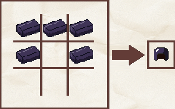
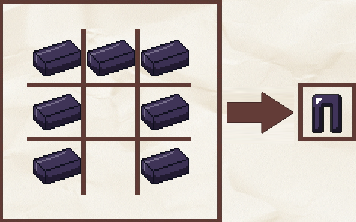
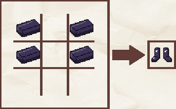

# 🤺 Armures

Le serveur possède de nouvelles armures, vous pouvez les retrouver dans le tableau ci-dessous.



L'armure en obsidienne est une armure créée par Plutonia. Elle est plus résistante que l'armure en diamant de Minecraft

Les ingrédients nécessaires à sa réalisation complète sont les suivants :&#x20;

* _<mark style="color:orange;">**Lingot d'obsidienne (x23)**</mark>_

***

**Casque :**&#x20;

<figure><figcaption>
Recette du casque
</figcaption></figure>

* Durabilité : _<mark style="color:orange;">**550**</mark>_
* Résistance : _<mark style="color:orange;">**+??**</mark>_

***

**Plastron :**&#x20;

<figure><figcaption>
Recette du plastron
</figcaption></figure>

* Durabilité : _<mark style="color:orange;">**800**</mark>_
* Résistance : _<mark style="color:orange;">**+??**</mark>_

***

**Jambières :**&#x20;

<figure><figcaption>
Recette des jambières
</figcaption></figure>

* Durabilité : _<mark style="color:orange;">**750**</mark>_
* Résistance : _<mark style="color:orange;">**+??**</mark>_

***

**Bottes :**&#x20;

<figure><figcaption>
Recette des bottes
</figcaption></figure>

* Durabilité : _<mark style="color:orange;">**650**</mark>_
* Résistance : _<mark style="color:orange;">**+??**</mark>_

***

Cette armure est également disponible dans le kit guerrier et paladin sur le serveur factions via la commande `/kit guerrier` `ou /kit paladin`.






















