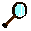
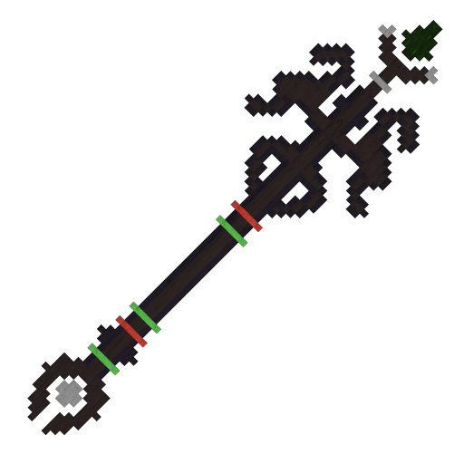
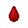
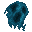

# ☁️ Autres

Le serveur possède de nombreux objets, vous pouvez les retrouver sur cette page.

 La loupe

 Le sceptre de creeper

 Le sang

 Les âmes

 La perle suprême

 L'interface de piratage

 Le chercheur de base

 Les orbes

 Les cœurs


Vous pouvez vous référer au wiki disponible en jeu pour voir les différentes recettes.

