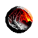

# ☁️ Autres

Le serveur possède de nombreux objets, vous pouvez les retrouver sur cette page.

 La loupe

Cet objet vous permet d'examiner le contenu d'un coffre sans interagir avec le contenu de celui-ci. La loupe a 10 utilisations maximales et est utilisable uniquement sur le serveur Factions.

 Le sceptre de creeper

Cet objet permet de faire apparaître un Creeper à l'endroit où vous cliquez. Le sceptre a un maximum de 5 utilisations. Il est exclusivement utilisable sur le serveur Factions.

 Le sang

Le sang est un ingrédient essentiel dans de nombreuses recettes. Il est exclusivement disponible sur le serveur Factions, avec un taux de récupération de 20% lorsque vous tuez un joueur.

 Les âmes (neutres et rares)

Les âmes sont au cœur du fonctionnement des [générateurs sombres](../les-blocs/generateurs-sombres.md). Mais il peut aussi être utile d'en avoir pour réaliser différentes recettes.

Pour en obtenir, il vous suffira simplement de miner n'importe quel minerai. Vous avez 1 chance sur 5000 d'obtenir une âme neutre, et 1 chance sur 10000 d'obtenir une âme rare.

 La perle suprême

La perle suprême possède le même fonctionnement qu'une Perle de l'Ender, sauf que celle-ci vous permet de passer à travers les fils, et les portails.

 L'interface de piratage

Utilisez cet objet pour piller une base ennemie sans TNT. Effectuez un clic droit sur le coffre ciblé, puis résolvez le code. Une fois déverrouillé, vous et votre faction aurez accès au contenu pendant 30 secondes. Mais attention, cet objet possède 10 essais maximum.

 Le chercheur de base

Le chercheur de base vous donne le nombre d'entités dans les chunks environnants, détectant uniquement dans un rayon de 3x3. Il permet de repérer les blocs suivants :

* Coffres
* Coffres en titane
* Fours
* Décrafteurs
* Désenchanteurs
* Entonnoirs
* Fours en topaze
* Droppers
* Distributeurs

 Les orbes

Les orbes sont des objets liés [aux gardiens](../les-monstres/les-gardiens.md), elles permettent de créer une gemme compressée. Celle-ci sera utilisée pour réaliser [le rituel](../../events/rituel.md).

 Les cœurs

Les cœurs sont au centre [des gardiens](../les-monstres/les-gardiens.md). Pour fabriquer un cœur, rassemblez les fragments nécessaires associés aux différents éléments.

Il existe 5 éléments différents :

* Feu
* Enfers
* Astres
* Nature
* Eau

Voici la liste de probabilité des différents fragments :

* Fragment central — 5%
* Fragment droit — 30%
* Fragment gauche — 40%
* Fragment haut — 15%
* Fragment bas — 10%

 Le trèfle

Le trèfle permet de créer un minerai aléatoire. Pour en obtenir, il suffit de récolter les nouvelles cultures disponibles sur le serveur. Vous aurez 5% de chance d'en récupérer un.

 Le scalpel

Le scalpel vous permet d'obtenir des symboles. Pour l'utiliser il vous faut simplement vous placer sur un tapis satanique, et faire un clic droit avec, une interface s'ouvrira alors.

Dans cette interface, vous pourrez sélectionner les symboles que vous souhaitez. Mais attention, ces symboles sont données de façon aléatoire, c'est-à-dire que si vous choisissez un Symbole (tier 1), cela vous donnera au hasard un symbole de tier 1.


Le scalpel possède 3 utilisations maximum. Il n'est pas possible d'y mettre un enchantement pour ajouter plus de durabilité.



Vous pouvez vous référer au wiki disponible en jeu pour voir les différentes recettes.

