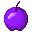
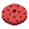
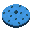

# 🍔 Nourritures

Le serveur possède de nouvelles nourritures, vous pouvez les retrouver dans le tableau ci-dessous.

 Pomme en Plutonium

La pomme en plutonium vous donne les effets suivants :

* Célérité II — 10 minutes.
* Absorption I — 2 minutes.

La version enchantée de la pomme en plutonium vous donne les effets suivants :

* Rapidité II — 2 minutes.
* Force II — 2 minutes.
* Absorption I — 2 minutes.
* Guérison instantanée II — 30 secondes.
* Sauts améliorés II — 2 minutes.
* Régénération I — 1 minute.
* Résistance I — 10 minutes.
* Anti chute I — 2 minutes.
* Résistance au feu I — 10 minutes.
* Invisibilité I — 1 minute.

 Hamburger

Le hamburger vous donne les effets suivants :

* Rapidité 2 — 6 minutes.

 Sucre d'orge

Le sucre d'orge vous donne les effets suivants :

* Sauts améliorés II — 2 minutes 30 secondes.

 Cookie doré

Le cookie doré vous donne les effets suivant :

* Rapidité II — 6 minutes.
* Force II — 5 minutes.
* Anti chute — 7 minutes.
* Résistance au feu I — 10 minutes.

 Cookie de régénération

Le cookie de régénération vous donne les effets suivants :

* Régénération I — 2 minutes 30 secondes.

 Cookie de résistance au feu

Le cookie de résistance au feu vous donne les effets suivants :

* Résistance au feu I — 10 minutes.

 Cookie de force

Le cookie de force vous donne les effets suivants :

* Force II — 5 minutes.

 Cookie d'anti chute

Le cookie d'anti chute vous donne les effets suivants :

* Anti chute I — 7 minutes.


Vous pouvez vous référer au wiki disponible en jeu pour voir les différentes recettes.

