# ⛏️ Outils

Le serveur possède de nouveaux outils, vous pouvez les retrouver dans le tableau ci-dessous.



## Pelle : 

Durabilité : <mark style="color:orange;">2000</mark>

Puissance : <mark style="color:orange;">1 / 6</mark>

## Pioche : 

Durabilité : <mark style="color:orange;">2000</mark>

Puissance : <mark style="color:orange;">1 / 6</mark>

## Hache : 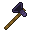

Durabilité : <mark style="color:orange;">2000</mark>

Puissance : <mark style="color:orange;">1 / 6</mark>

## Faux : 

Durabilité : <mark style="color:orange;">2000</mark>

Puissance : <mark style="color:orange;">1 / 6</mark>

## Paxel : 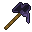

Durabilité : <mark style="color:orange;">2000</mark>

Puissance : <mark style="color:orange;">1 / 6</mark>



## Pelle : 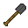

Durabilité : <mark style="color:orange;">2500</mark>

Puissance : <mark style="color:orange;">2 / 6</mark>

## Pioche : 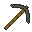

Durabilité : <mark style="color:orange;">2500</mark>

Puissance : <mark style="color:orange;">2 / 6</mark>

## Hache : 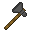

Durabilité : <mark style="color:orange;">2500</mark>

Puissance : <mark style="color:orange;">2 / 6</mark>

## Faux : 

Durabilité : <mark style="color:orange;">2500</mark>

Puissance : <mark style="color:orange;">2 / 6</mark>

## Paxel : 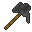

Durabilité : <mark style="color:orange;">2500</mark>

Puissance : <mark style="color:orange;">2 / 6</mark>



## Pelle : 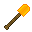

Durabilité : <mark style="color:orange;">3000</mark>

Puissance : <mark style="color:orange;">3 / 6</mark>

## Pioche : 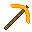

Durabilité : <mark style="color:orange;">3000</mark>

Puissance : <mark style="color:orange;">3 / 6</mark>

## Hache : 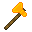

Durabilité : <mark style="color:orange;">3000</mark>

Puissance : <mark style="color:orange;">3 / 6</mark>

## Faux : 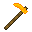

Durabilité : <mark style="color:orange;">3000</mark>

Puissance : <mark style="color:orange;">3 / 6</mark>

## Paxel : 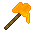

Durabilité : <mark style="color:orange;">3000</mark>

Puissance : <mark style="color:orange;">3 / 6</mark>



## Pelle : 

Durabilité : <mark style="color:orange;">3500</mark>

Puissance : <mark style="color:orange;">4 / 6</mark>

## Pioche : 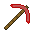

Durabilité : <mark style="color:orange;">3500</mark>

Puissance : <mark style="color:orange;">4 / 6</mark>

## Hache : 

Durabilité : <mark style="color:orange;">3500</mark>

Puissance : <mark style="color:orange;">4 / 6</mark>

## Faux : 

Durabilité : <mark style="color:orange;">3500</mark>

Puissance : <mark style="color:orange;">4 / 6</mark>

## Paxel : 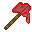

Durabilité : <mark style="color:orange;">3500</mark>

Puissance : <mark style="color:orange;">4 / 6</mark>



## Pelle : 

Durabilité : <mark style="color:orange;">4000</mark>

Puissance : <mark style="color:orange;">5 / 6</mark>

## Pioche : 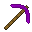

Durabilité : <mark style="color:orange;">4000</mark>

Puissance : <mark style="color:orange;">5 / 6</mark>

## Hache : 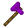

Durabilité : <mark style="color:orange;">4000</mark>

Puissance : <mark style="color:orange;">5 / 6</mark>

## Faux : 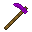

Durabilité : <mark style="color:orange;">4000</mark>

Puissance : <mark style="color:orange;">5 / 6</mark>

## Paxel : 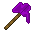

Durabilité : <mark style="color:orange;">4000</mark>

Puissance : <mark style="color:orange;">5 / 6</mark>



## Pioche : 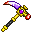

Durabilité : <mark style="color:orange;">5000</mark>

Puissance : <mark style="color:orange;">6 / 6</mark>

Avantages :

* Celle-ci vous permet de miner des minerais en ayant l'enchantement "Fortune II" appliqué par défaut. Cet enchantement s'appliquera aussi sur tous les minerais de mercure et de plutonium minés.&#x20;

## Faux : 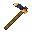

Durabilité : <mark style="color:orange;">5000</mark>

Puissance : <mark style="color:orange;">6 / 6</mark>

Avantages :

* Celle-ci vous permet de récolter, et replanter automatiquement une plantation en faisant un clic droit dessus.




Vous pouvez vous référer au wiki disponible en jeu pour voir les différentes recettes.

