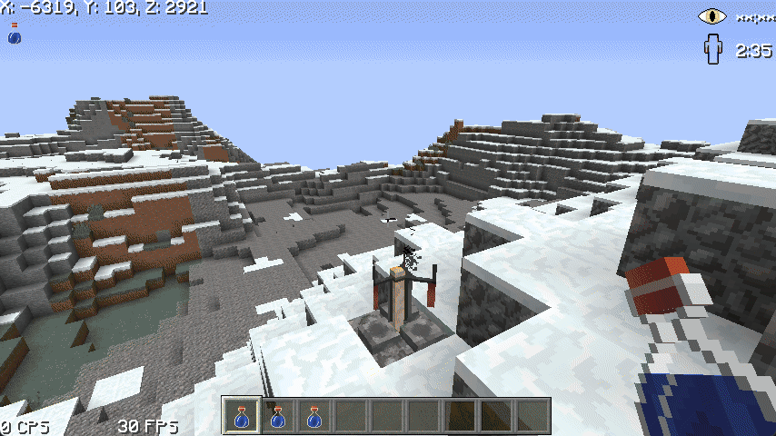
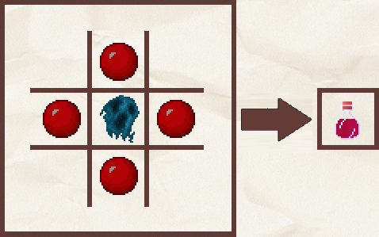

# 🥃 Potions

Le serveur possède de nouvelles potions, vous pouvez les retrouver dans le tableau ci-dessous.



La potion de lait est une potion spéciale disponible exclusivement dans le kit alchimiste, achetable dans [notre boutique](https://plutonia-mc.fr/shop/categories/kits). Elle neutralise tous les effets négatifs, comme le poison, la lenteur et la faiblesse.



La potion d'anti-chute est une potion spéciale disponible dans le kit alchimiste, achetable dans [notre boutique](https://plutonia-mc.fr/shop/categories/kits). Elle permet de ne prendre aucun dégât de chute. Celle-ci peut également être fabriquées directement en jeu comme dans la vidéo ci-dessous.

<figure><figcaption>
Recette de la potion d’anti-chute
</figcaption></figure>



La potion d'intuition est une potion spéciale disponible dans le kit alchimiste, achetable dans [notre boutique](https://plutonia-mc.fr/shop/categories/kits). Elle permet de voir les joueurs invisibles. Celle-ci est réalisable comme dans l'image ci-dessous.

<figure><figcaption>
Recette de la potion d'intuition
</figcaption></figure>

Une fois l'effet appliqué, vous verrez les joueurs invisibles comme dans la vidéo ci-dessous.

<figure><figcaption>
Effet de potion Intuition
</figcaption></figure>


