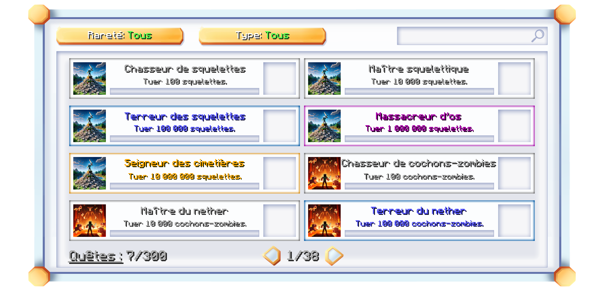

# 🤔 Les quêtes

Curieux de savoir l'utilité de nos quêtes ou comment elles fonctionnent ? Vous êtes au bon endroit !

Nos quêtes sont conçues dès le départ pour être des succès, c'est-à-dire qu'elles ne soient pas trop difficiles à terminer, et qu'elles ne soient pas banales comme sur la plupart des serveurs. Vous avez accès à plus de 300 quêtes, toutes différentes, et plus ou moins faciles à réaliser.

Notre plugin assure la synchronisation des quêtes sur tous les serveurs, permettant leur progression, quel que soit le serveur sur lequel vous vous trouvez.

### Comment accéder aux quêtes ?

Vous pouvez simplement accéder aux quêtes grâce à la commande `/quetes`. Celle-ci ouvrira une interface comme celle ci-dessous.

<figure><figcaption>
Quêtes de Plutonia
</figcaption></figure>

Vous pouvez appliquer différent filtres en cliquant soit sur `Rareté`, ou `Type`, voici les différents niveaux de rareté, du plus courant au plus rare :

* Commun
* <mark style="color:blue;">Rare</mark>
* <mark style="color:purple;">Épique</mark>
* <mark style="color:orange;">Légendaire</mark>
* <mark style="color:red;">Ultime</mark>


Une fois qu'une quête est terminée, vous recevrez une caisse correspondant à la rareté de celle-ci.


🎉 Et voilà, vous venez de découvrir les quêtes de Plutonia.
