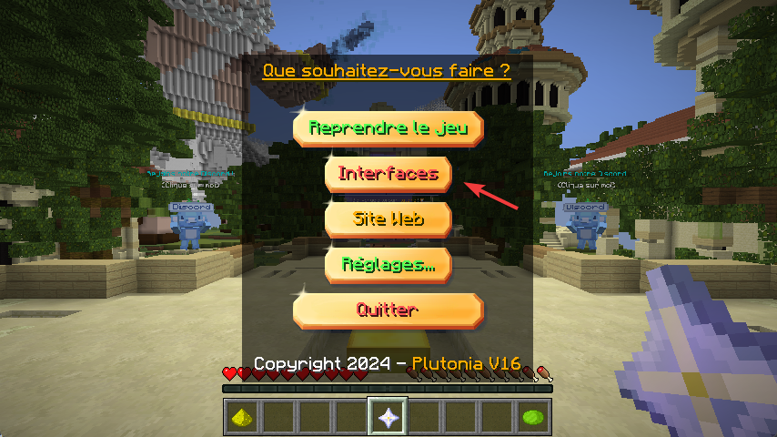
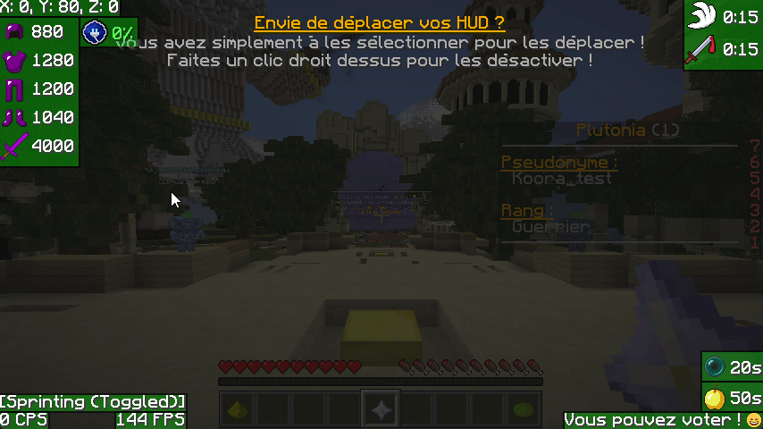

# 🔧 Déplacer les interfaces

Si vous souhaitez déplacer vos interfaces et afficher vos FPS en haut à droite, c'est extrêmement simple sur Plutonia ! 😎

Il vous suffira d'appuyer sur la touche `Échap`, et de cliquer sur le bouton `Interfaces`, comme montré sur l'image ci-dessous.

<figure><figcaption>
Menu Échap de Plutonia
</figcaption></figure>

Une fois dans cette interface, tous les modules peuvent être déplacés. Voir l'exemple ci-dessous.

<figure><figcaption>
Exemple de déplacement des modules
</figcaption></figure>


Pour désactiver un module, faites un clic droit dessus et il passera en rouge, ce qui signifie qu'il est inactif.

