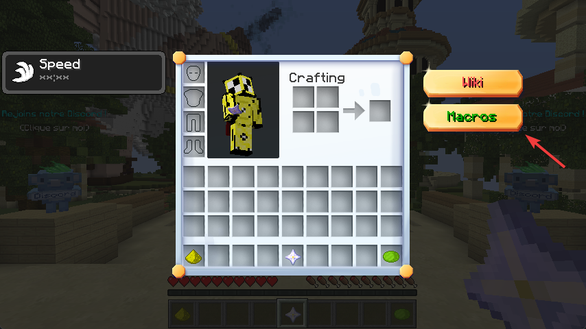
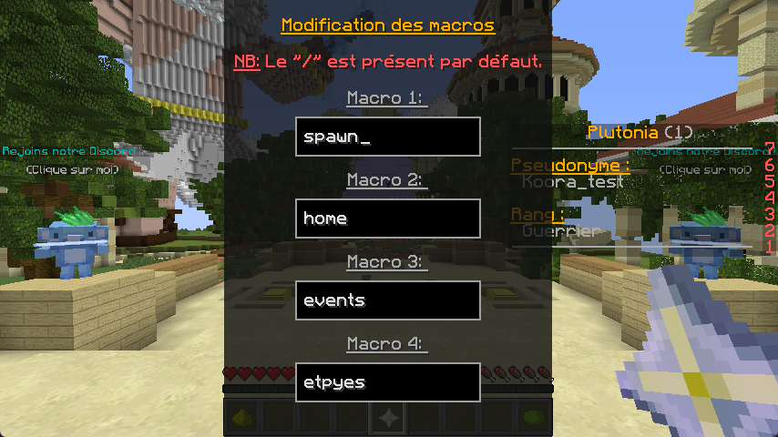

# 📪 Macros

Vous souhaitez créer des macros sans recourir à un logiciel tiers souvent complexe ? Vous êtes au bon endroit. Créer une macro est très simple !

### Mais comment faire ?

Il vous suffit de vous rendre dans votre inventaire, et de cliquer sur le bouton `Macro`.

<figure><figcaption>
Inventaire de Plutonia
</figcaption></figure>

Une fois terminé, une interface semblable à celle ci-dessous s'ouvrira. Remplissez simplement les champs avec les commandes souhaitées.

<figure><figcaption>
Interface des macros de Plutonia
</figcaption></figure>

Une fois la commande configurée, appuyez simplement sur la touche `Échap` pour sauvegarder vos macros et quitter l'interface.

### Comment les déclencher ?

Pour modifier les touches de macros, allez dans les paramètres de configuration des touches et sélectionnez la catégorie `Plutonia`. Ici, vous pouvez changer les touches de macro selon vos envies.

🎉 Et voilà, vous venez de définir une macro, et vous savez maintenant les utiliser.
