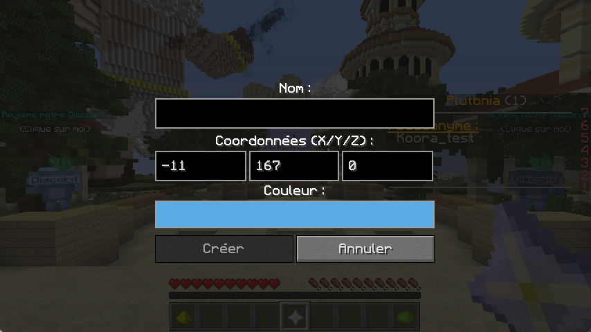

# 🧭 Waypoints

Vous n'avez plus de foyers à définir ? Ou avez-vous de nombreuses positions importantes à sauvegarder ? We've got you covered !

### Comment s'en servir ?

Il est très simple de s'en servir, ne vous en faites pas ! Pour cela, rendez-vous dans les paramètres de configuration de vos touches, et allez dans la catégorie `Waypoints`. Une fois cela fait, veuillez définir les touches souhaitées pour `Afficher la liste` des Waypoints, et `Créer un Waypoint`.

Une fois cela fait, <mark style="color:orange;">veuillez appuyer sur la touche pour créer un waypoint</mark>, une interface comme celle ci-dessous s'ouvrira.

<figure><figcaption>
Interface de création de Waypoint
</figcaption></figure>

Il vous suffira alors de remplir le nom souhaité, et de choisir la couleur. Pour le créer, il vous faudra cliquer sur le bouton `Créer`.

Pour supprimer un waypoint, appuyez sur la touche qui affiche la liste des waypoints, et sélectionnez le waypoint à supprimer.

🎉 Et voilà, vous venez de découvrir les `Waypoints`, et vous savez maintenant les utiliser.
