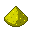
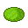
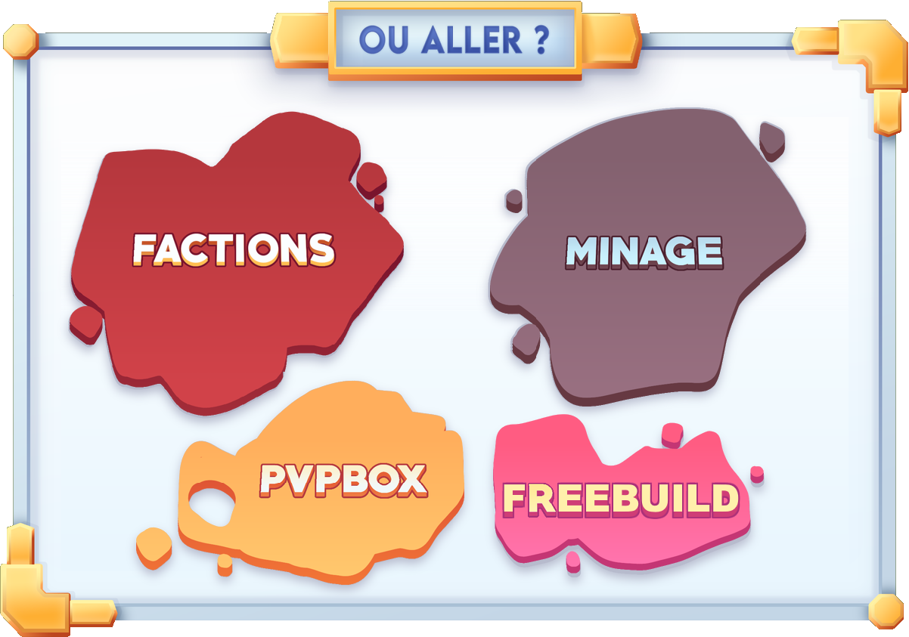

# ❓ Bien débuter

### 🤔 Vous êtes nouveau, et vous souhaitez savoir comment bien débuter sur le serveur ?

Lors de votre première connexion, vous serez dirigé vers l'un de nos lobbys. Cette étape sera tout le temps la même lors de votre connexion.

Une fois connecté, vous aurez dans votre barre d'inventaire les objets suivants: , , et .

⚠️ Ce qui nous intéresse ici est l'objet . Pour les autres objets, veuillez vous référer à [cette section](../mondes/lobbys.md).

En effectuant un clic droit sur l'objet , une interface apparaitra, celle-ci ressemblera à celle-ci :

<figure><figcaption>
Carte de navigation de Plutonia
</figcaption></figure>

Vous aurez le choix parmi différents serveurs. Pour plus d'informations sur chaque serveur, consultez [cette section](broken-reference).

Le serveur qui nous intéresse ici est le serveur `Minage`.


Notez qu'il y a trois serveurs de minage à votre disposition, et les mondes diffèrent entre ces serveurs, et que tous les inventaires sont synchronisés.


Une fois connecté à un serveur de minage, vous aurez accès au kit `Outils`. <mark style="color:orange;">Ce kit est essentiel si vous n'avez pas encore fabriqué d'outils, et que vous êtes nouveau.</mark> Ce kit contient tous les outils nécessaires pour miner, ils sont fabriqués en obsidienne. Pour le récupérer, entrez juste la commande `/kit outils`.

Pour commencer à miner, vous avez simplement à passer dans le portail en face de vous pour être téléporté aléatoirement. Pour voir toutes les commandes disponibles dans le monde `Minage`, veuillez vous référer à [cette section](../mondes/minage.md).

Après avoir terminé votre session de minage, utilisez la commande `/factions` pour accéder au monde `PvP/Factions` et commencer à créer votre base !


Pour plus d'informations concernant le monde `PvP/Factions`, veuillez vous référer à [cette section](../mondes/factions.md).


Et voilà, c'est déjà terminé, c'est plutôt simple, non ? N'hésitez pas à consulter cette section pour connaitre tous les mondes disponibles, et leur utilité.


Pour soutenir le serveur et accélérer votre progression, découvrez les divers avantages disponibles dans notre [boutique en ligne](https://plutonia-mc.fr/shop). Vous pouvez acheter différents kits, grades et cosmétiques.

