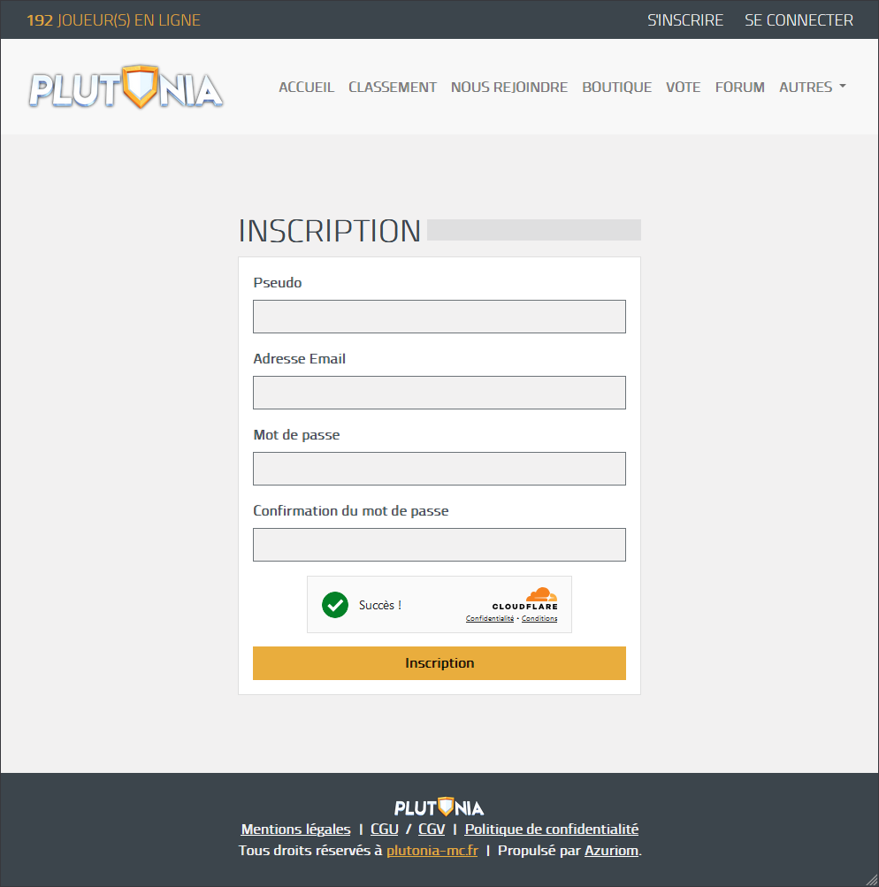
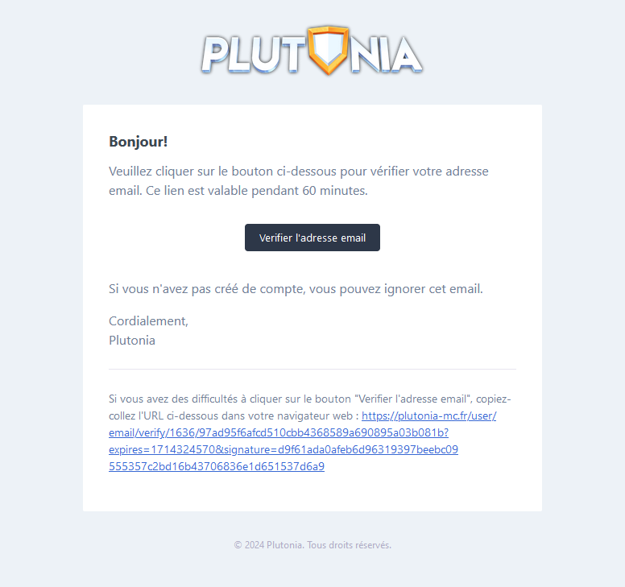

# Créer un compte

Avant de venir jouer, il vous faudra vous <mark style="color:orange;">créer un compte</mark>, c'est très simple !

Pour commencer, rendez-vous sur notre site internet et accédez à [la section d'inscription](https://plutonia-mc.fr/user/register), située en haut à droite de la page.

Si vous avez déjà un compte, inutile d'en créer un nouveau ! 😉

### Inscription

Après avoir accédé à la page d'inscription, vous verrez un écran similaire à celui-ci :

<figure><figcaption>
Page d'inscription de Plutonia
</figcaption></figure>

Il vous suffira simplement de rentrer le <mark style="color:orange;">pseudonyme que vous souhaitez prendre</mark>, une <mark style="color:orange;">adresse e-mail valide</mark>, ainsi qu'un <mark style="color:orange;">mot de passe robuste et unique</mark>.

⚠️ Votre pseudonyme doit faire au minimum 3 caractères, et au maximum 12 caractères. Il ne doit pas comprendre de caractères spéciaux.

⚠️ Votre adresse e-mail doit être valide, car elle sera vérifiée.

⚠️ Assurez-vous que votre mot de passe est sécurisé et unique, c'est-à-dire qu'il ne doit être utilisé que sur notre serveur et ne pas avoir été utilisé autre part.

Une fois tous les champs remplis, cliquez simplement sur le bouton "Inscription".

Un e-mail sera donc envoyé à l'adresse e-mail renseignée, veuillez donc vérifier votre boite de réception. L'expéditeur du mail est "Plutonia".

L'e-mail devrait ressembler à celui-ci :

<figure><figcaption>
E-mail de vérification de Plutonia
</figcaption></figure>

Il vous suffit simplement de cliquer sur le bouton "Vérifier l'adresse e-mail" pour confirmer votre inscription.

🎉 Et voilà, votre compte a été crée avec succès, il vous reste plus qu'à accéder à notre lanceur.
