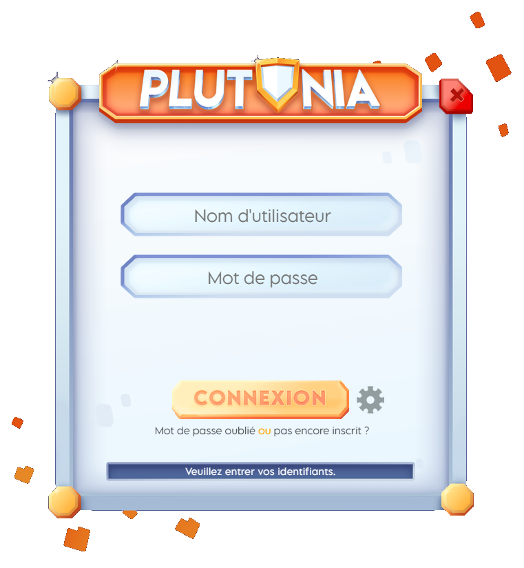

# 📂 Installer le lanceur

Pour commencer, téléchargez notre lanceur depuis [cette page](https://plutonia-mc.fr/join).

Notre lanceur est facile à utiliser, assurez-vous simplement d'avoir déjà [crée un compte](creer-un-compte.md) sur notre [site internet](https://plutonia-mc.fr/).


* Assurez-vous de sélectionner le lanceur correspondant à votre système d'exploitation.
* Les mises à jour automatiques ne sont pas disponibles sur macOS.


### 🖥️ Windows

Téléchargez le lanceur et exécutez-le.

Une fenêtre d'installation apparaîtra—veuillez ne pas y toucher tant que l'installation n'est pas terminée.

✔️ Sur votre bureau, un raccourci nommé `Plutonia` sera disponible. Cliquez simplement dessus pour le lancer.

### 🖥️ macOS

Téléchargez le lanceur et exécutez-le. Une fois exécuté, glissez l'application `Plutonia` (à gauche) dans le dossier `Applications` (à droite).

✔️ Vous pourrez ensuite trouver le lanceur dans vos applications. Vous n'avez plus qu'à le lancer !

### 🖥️ Linux

Téléchargez le lanceur, et déplacez-le sur votre bureau.

Veuillez vous assurer d'avoir `libfuse2` d'installé. Si ce n'est pas le cas, vous pouvez l'installer avec la commande suivante : `apt install libfuse2`.

Une fois installé, veuillez faire un clic droit sur le fichier `Plutonia-linux-x86_64.AppImage` téléchargé, puis allez dans les propriétés de ce fichier. Rendez le exécutable en cochant l'option `Exécutable comme programme`.

✔️ Il vous suffira alors simplement d'effectuer un double clic dessus pour le lancer.


Ces étapes ont été effectuées sous Ubuntu 24.10, mais des manipulations similaires s'appliquent aux autres distributions.


### 🤔 Et après ?

Une fois le lanceur installé et lancé, une fenêtre comme celle-ci s'ouvrira :

<figure><figcaption>
Lanceur de Plutonia
</figcaption></figure>

Il vous suffira alors de simplement <mark style="color:orange;">rentrer le pseudonyme et mot de passe</mark> que vous utilisez sur notre [site internet](https://plutonia-mc.fr/), et de cliquer sur le bouton `Connexion`.

Si vous avez un soucis avec notre lanceur, veuillez vous référer à notre [guide de dépannage](https://plutonia-mc.fr/join).
